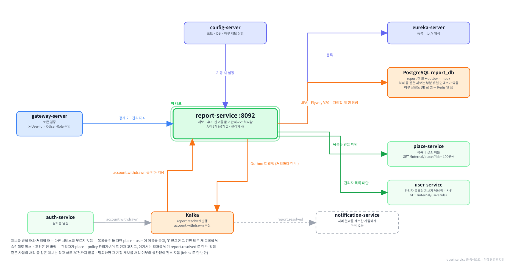

# report-service

**함께하개**는 반려동물과 함께 갈 수 있는 장소를 찾고, 우리 아이가 그곳에
들어갈 수 있는지 판정해 주는 서비스입니다.

이 저장소는 그중 **제보를 받아 두는 서버**입니다.
사용자가 올린 장소 정보 제보와 불건전 후기 신고를 받아 두고, 관리자가 승인하거나 반려하면
그 결과를 알림 서비스(notification)가 받아 갈 수 있게 이벤트로 냅니다.
장소 정보를 직접 고치지는 않습니다. 고치는 곳은 장소 서비스(place)와 조건 서비스(policy)입니다.

---

**먼저 전체 그림을 보고, 이 레포가 그 안 어디에 있는지 본 뒤 읽습니다.**

**① 전체 구조 — 층으로 본 것.** 위에서 아래로 요청이 내려가고, 어느 층에 무엇이 있는지.


**② 전체 구조 — 서비스끼리 무엇을 주고받는지.** 초록 실선이 `/internal` 호출, Kafka 표가 이벤트, 하늘색 점선이 VPC 경계.


**③ 이 레포를 중심으로.** 직접 연결된 것만 남긴 그림.



<br><br>

---

## 본문 시작

<br><br>

---

## 먼저 알아 두면 좋은 것

이 문서에 자주 나오는 말 셋입니다. 더 자세한 설명은 [service-template 의 용어 장](https://github.com/paw-trail/service-template#11-용어)에 있습니다.

**게이트웨이가 넣어 주는 헤더 둘.** 브라우저의 요청은 게이트웨이(gateway-server)를 거치며 로그인 토큰을 검사받고,
게이트웨이가 `X-User-Id`(계정 식별자)와 `X-User-Role`(`USER` 또는 `ADMIN`)을 붙여 이 서비스로 넘깁니다.
이 서비스는 그 두 헤더만 보고 누가 부르는지 압니다.
로컬에서 게이트웨이를 거치지 않고 직접 부를 때는 이 둘을 손으로 싣습니다([1-7](#1-7-첫-제보와-처리)).

**Outbox.** 관리자가 처리한 결과를 알리는 이벤트를 곧바로 카프카로 보내지 않고,
처리와 같은 트랜잭션 안에서 `outbox` 표에 먼저 적어 둡니다. 커밋이 끝난 직후 공통 모듈이 그 행을 보내고,
실패하면 되풀이해 보냅니다. 그래서 "처리는 됐는데 알림이 안 나갔다" 나 그 반대가 생기지 않습니다([6장](#6-이벤트)).

**Inbox.** 카프카는 같은 메시지를 두 번 건넬 수 있습니다. 받은 이벤트의 식별자를 `processed_event` 표에 적어 두고,
이미 적혀 있으면 건너뜁니다. 이 서비스는 탈퇴 이벤트를 이 방식으로 받습니다([6장](#6-이벤트)).

<br><br>

---

## 0. 이 서비스가 하는 일

### 0-1. 한 문장

> 사용자가 올린 장소 정보 제보와 후기 신고를 받아 두고, 관리자가 한 번 승인하거나 반려하면
> 그 결과를 `report.resolved` 로 알립니다.

예를 들어 한 사용자가 장소 두 곳에 제보 셋을 올리면 관리자 목록에 이렇게 나옵니다. 가장 최근 것이 위입니다.

| 유형 | 장소 | 제보자 | 상태 |
|---|---|---|---|
| `REVIEW_ABUSE` 불건전 후기 | [북악하늘길 스카이웨이] 하늘한마당~하늘마루 | 다정이네 | `PENDING` |
| `INFO_WRONG` 장소 정보가 틀림 | [북악하늘길 스카이웨이] 하늘한마당~하늘마루 | 다정이네 | `PENDING` |
| `CLOSED` 폐업 | 옥토끼우주센터 | 다정이네 | `PENDING` |

장소 이름은 장소 서비스에서, 제보자 닉네임은 사용자 서비스(user)에서 받아 채운 값입니다.
관리자가 폐업 제보를 확인해 승인하면 응답의 `data` 에 처리 결과가 돌아오고, 같은 순간 `report.resolved` 이벤트가 한 건 나갑니다.

```json
{
  "reportId": "01a0bb2f-541a-79e6-b8b1-ce3e57debb52",
  "status": "ACCEPTED",
  "memo": "폐업을 확인해 장소를 닫았습니다",
  "reviewedBy": "00000000-0000-7000-8000-00000000a0a0",
  "reviewedAt": "2026-09-20T04:40:55.014163269"
}
```

승인한다고 장소가 닫히지는 않습니다. 관리자가 장소 서비스의 관리자 API 로 먼저 폐업 처리하고,
이 서비스에서는 그 결과를 남기고 알립니다([5장](#5-관리자-처리)).

---

### 0-2. 다른 서비스와의 자리

```
                                     ┌──목록의 장소 이름──────▶ place-service
브라우저 ──▶ gateway-server ──▶ report-service
                                     ├──관리자 목록의 제보자──▶ user-service
                                     └──report.resolved───────▶ Kafka ──▶ notification-service (아직 없음)

auth-service ──account.withdrawn──▶ Kafka ──▶ report-service
```

| 상대 | 이 서비스가 하는 일 | 경로 |
|---|---|---|
| 브라우저 (게이트웨이를 거침) | 제보 올리기 · 내 제보 보기 | `POST /api/v1/reports` · `GET /api/v1/reports/me` |
| 관리자 (게이트웨이를 거침) | 제보 목록 · 승인 · 반려 · 발행이 멈춘 이벤트 다시 보내기 | `/api/v1/admin/reports/**` 4개 |
| place-service | 목록에 장소 이름을 채움 — 100곳씩 | `GET /internal/places?ids=` |
| user-service | 관리자 목록에 제보자 닉네임 · 사진을 채움 | `GET /internal/users?ids=` |
| Kafka | 처리 결과를 냄 · 탈퇴를 받음 | 토픽 `report.resolved` · `account.withdrawn` |
| auth-service | 탈퇴를 알림 (카프카를 거침) | — |
| notification-service | 처리 결과를 받아 제보한 사람에게 알림 — 아직 없음 | — |

**제보를 받을 때와 처리할 때는 다른 서비스를 부르지 않습니다.** 장소가 실제로 있는지도 묻지 않습니다.
제보는 장소 상세에서만 시작되고, 장소 서비스가 잠시 멈췄다고 "정보가 틀렸어요" 를 못 받으면 안 되기 때문입니다([3장](#3-받는-차례)).
장소 · 사용자 서비스는 목록을 만들 때만 부릅니다.

**후기 서비스(review)는 부르지 않습니다.** 후기 신고를 받아도 그 후기가 있는지 묻지 않고, 승인해도 후기를 지우지 않습니다.
후기는 관리자가 review 의 관리자 기능으로 지웁니다([5장](#5-관리자-처리)).

**장소 · 조건을 고치지 않습니다.** 고치는 권한은 place · policy 에 있고, 관리자가 그쪽 관리자 API 로 고칩니다.

---

### 0-3. 무엇이 들어 있나

| 들어 있는 것 | 하는 일 | 자세히 |
|---|---|---|
| 제보 받기 | 유형 5종 · 유형마다 받는 칸 · 처리 중인 같은 제보 막기 · 하루 20건 | [2장](#2-유형과-칸-규칙) · [3장](#3-받는-차례) |
| 목록 | 내 제보 · 관리자 목록 · 장소 이름과 제보자 채우기 | [4장](#4-목록) |
| 관리자 처리 | 승인 · 반려를 한 번만 · 동시에 눌러도 한 번 | [5장](#5-관리자-처리) |
| 이벤트 | `report.resolved` 발행 · `account.withdrawn` 소비 · 멈춘 이벤트 다시 보내기 | [6장](#6-이벤트) |

없는 것도 적어 둡니다. 처음 보는 사람이 가장 많이 찾는 것들입니다.

| 없는 것 | 까닭 |
|---|---|
| 장소 · 조건 정정 | place · policy 의 관리자 API 가 합니다 |
| 후기 삭제 | review 의 관리자 기능이 할 일이고, 아직 review 에 없습니다([14장](#14-아직-안-한-것)) |
| 알림 보내기 | notification 이 `report.resolved` 를 받아 합니다. 아직 없습니다 |
| 사용자가 제보를 고치거나 지우는 기능 | 없습니다. 올린 제보는 관리자가 처리할 때까지 그대로 둡니다 |
| 처리 되돌리기 | 없습니다. 잘못 처리했으면 사용자가 새로 제보합니다([5장](#5-관리자-처리)) |
| Redis | 쓰지 않습니다. 하루 상한도 DB 로 셉니다 |

---

### 0-4. 6가지만 기억하면 됩니다

**① 제보는 기록이지 정정이 아닙니다.** 승인해도 장소 · 조건 값은 그대로입니다.
관리자가 place · policy 의 관리자 API 로 먼저 고치고, 이 서비스에는 처리 결과만 남깁니다.

**② 유형마다 받는 칸이 다릅니다.** 5종의 규칙은 이 서비스가 가지고, 칸 이름의 목록은 화면이 가집니다.
받지 않는 칸에 값이 오면 400 입니다([2장](#2-유형과-칸-규칙)).

**③ 같은 사람의 처리 중인 같은 제보는 하나뿐이고, 하루 20건까지 받습니다.** 넘기면 409 · 429 입니다([3장](#3-받는-차례)).

**④ 다른 서비스는 목록을 만들 때만 부릅니다.** 못 부르면 이름 칸만 비운 채 목록을 냅니다([4장](#4-목록)).

**⑤ 처리는 한 번뿐입니다.** 두 관리자가 동시에 눌러도 행 잠금으로 줄을 세워 한 번만 처리하고,
`report.resolved` 도 제보 1건에 한 번 나갑니다([5장](#5-관리자-처리)).

**⑥ 탈퇴하면 그 계정의 제보를 전부 지웁니다.** 처리 전 · 처리한 것을 가리지 않습니다([6장](#6-이벤트)).

---

### 0-5. 화면에서 어디에 쓰이나

| 화면 | 쓰이는 것 | 부르는 경로 |
|---|---|---|
| 장소 상세 「정보가 틀렸어요」 | 장소 정보 · 동반 조건 · 잘못 묶임 · 폐업 제보 | `POST /api/v1/reports` |
| 장소 상세의 후기 카드 「신고」 | 불건전 후기 신고 — 그 후기가 달린 장소의 식별자를 함께 보냄 | `POST /api/v1/reports` |
| 마이페이지 고객센터 | 내가 올린 제보와 처리 결과 · 관리자 메모 | `GET /api/v1/reports/me` |
| 관리자 제보 목록 | 상태별 제보 · 장소 이름 · 제보자 | `GET /api/v1/admin/reports` |
| 관리자 처리 창 | 승인 · 반려와 메모 | `PATCH /api/v1/admin/reports/{reportId}` |
| 관리자 운영 | 발행이 멈춘 이벤트 · 다시 보내기 | `GET /api/v1/admin/reports/outbox` · `POST …/outbox/{outboxId}/retry` |

**칸 이름과 소스 목록은 화면이 가집니다.** 「정보가 틀렸어요」 에서 어느 칸이 틀렸는지 고르는 드롭다운은
장소 칸(`tel` · `homepage` …)과 조건 칸(`maxWeightKg` …)을 화면이 그립니다. 이 서비스는 고른 이름을 그대로 받아 둡니다([2장](#2-유형과-칸-규칙)).

**후기 신고의 처리는 사람이 이어 줍니다.** 관리자는 신고 카드의 [후기 보러 가기] 로 장소 상세의 후기 카드에 가서 그 후기를 지우고,
돌아와 신고를 승인합니다. 후기 카드의 삭제 버튼은 review 에 관리자 삭제가 생기면 붙습니다([14장](#14-아직-안-한-것)).

<br><br>

---

## 1. 로컬에서 띄우기

### 1-1. 전체 흐름

| 순서 | 할 일 | 확인 |
|---|---|---|
| ① | 인프라 컨테이너 — postgres · kafka · config-server · eureka-server | `docker compose ps` 에 `healthy` |
| ② | 재료 서비스 — place · user | 둘 다 유레카에 `UP` |
| ③ | 이미지 준비 — 배포된 이미지를 받거나 직접 굽기 | `docker image ls` 에 `report-service` |
| ④ | 이 서비스 실행 | 컨테이너가 `healthy` |
| ⑤ | 떴는지 확인 | 상태 확인 · 유레카 등록 · Flyway |
| ⑥ | 첫 제보와 처리 | 201 · 내 목록 · 200 · 다시 처리하면 409 |

---

### 1-2. 인프라 컨테이너

infra 레포에서 띄웁니다. 이 서비스는 postgres(`report_db`) · kafka 를 씁니다. Redis 는 쓰지 않습니다.

```bash
cd ../infra
docker compose up -d
docker compose ps
```

Windows 와 macOS 가 같습니다. `.env` 의 `COMPOSE_PROFILES` 에 `infra` · `platform` · `db` 가 들어 있어야
kafka(`infra`) · config-server · eureka-server(`platform`) · postgres(`db`) 가 뜹니다. 프로파일의 뜻은 infra README 에 있습니다.

`report_db` 와 계정 `report_svc` 는 postgres 가 처음 뜰 때 infra 의 초기화 스크립트가 만듭니다.
표는 이 서비스가 뜰 때 Flyway 가 만듭니다 — 공통 표 2개(`outbox` · `processed_event`)와 이 서비스의 `report` 입니다.

---

### 1-3. 재료 서비스

| 서비스 | 포트 | 이 서비스가 쓰는 곳 | 준비돼 있어야 하는 것 |
|---|---|---|---|
| place-service | 8084 | 목록의 장소 이름 | place_db 에 장소가 채워져 있어야 함 — 없는 장소는 이름이 비어 나옴 |
| user-service | 8082 | 관리자 목록의 제보자 닉네임 · 사진 | user_db 에 그 계정의 프로필 — 없으면 닉네임이 비어 나옴 |

**둘 다 없어도 제보 받기와 처리는 됩니다.** 목록의 이름 칸만 비고 목록은 그대로 나옵니다([4장](#4-목록)).
이름까지 보려면 둘을 함께 띄웁니다. place_db 는 수집 서비스(ingest)가 채웁니다. 비어 있으면 그 README 의 적재 절차를 따릅니다.

⛔**IntelliJ 와 컨테이너를 섞으면 서로 못 찾습니다.** 이 서비스는 place · user 의 주소를 유레카에서 받는데,
컨테이너로 뜬 서비스는 도커 안쪽 주소(`172.18.x.x`)로 등록되어 호스트에서 뜬 쪽이 그 주소에 닿지 못합니다([13장](#13-막히기-쉬운-자리)).
이 문서는 전부 컨테이너로 띄우는 길을 적습니다.

---

### 1-4. 이미지 준비

**배포된 이미지를 쓸 때** — infra 폴더에서 받습니다. Windows 와 macOS 가 같습니다.

```bash
docker compose --profile infra --profile platform --profile db --profile app pull report-service
```

**코드를 고쳐 확인할 때** — 이 레포에서 jar 를 만들고 같은 이름으로 굽습니다. 레지스트리에 올리지 않습니다.
배포 이미지는 태그를 단 `main` 에서만 굽습니다([11장](#11-운영)).

```bash
./gradlew clean bootJar
docker build -t ghcr.io/paw-trail/report-service:latest .
```

Windows 는 `./gradlew` 대신 `.\gradlew` 를 써도 됩니다. PowerShell 7 에서는 `./gradlew` 도 그대로 됩니다. 나머지는 같습니다.

---

### 1-5. 실행

infra 폴더에서 이 서비스와 재료 서비스를 함께 올립니다. Windows 와 macOS 가 같습니다.

```bash
docker compose --profile infra --profile platform --profile db --profile app up -d report-service place-service user-service eureka-server
```

`--profile` 을 명령에 붙이면 `.env` 의 `COMPOSE_PROFILES` 가 통째로 바뀌므로 필요한 프로파일을 모두 적습니다.
일부만 적으면 `depends on undefined service` 로 멈춥니다.
`up -d` 에 서비스 이름을 붙이면 기다리는 것만 함께 올라오고 eureka 는 안 올라오므로 함께 적습니다.

직접 구운 이미지를 쓸 때는 `--pull never` 를 붙여 둡니다. 이미지가 없으면 레지스트리에서 받아 오지 않고 바로 알려 주므로,
모르는 사이 배포 이미지로 도는 일이 없습니다. 코드를 고쳐 이미지를 다시 구웠다면 이 서비스만 새로 올립니다.

```bash
docker compose --profile infra --profile platform --profile db --profile app up -d --no-deps --pull never --force-recreate report-service
```

`--force-recreate` 는 이미지 이름이 같아서 붙입니다. 없으면 compose 가 바뀐 것이 없다고 보고 옛 컨테이너를 그대로 둘 수 있습니다.

⚠**갈아 끼운 직후에는 1분쯤 기다립니다.** 상태가 `health: starting` 일 때 부르면 포트는 열려 있어도 연결이 끊깁니다.
아래 확인 명령은 `healthy` 가 될 때까지 기다리는 줄부터 시작합니다.

---

### 1-6. 떴는지 확인

상태 확인이 `UP` 인 것만으로 끝내지 않고 유레카 등록과 Flyway 까지 봅니다.
유레카 등록이 실패해도 상태 확인은 `UP` 으로 나올 수 있습니다.

Windows (PowerShell 7)

```powershell
while ((docker inspect -f "{{.State.Health.Status}}" pawtrail-report-service) -ne "healthy") { Start-Sleep -Seconds 3 }
foreach ($app in "REPORT-SERVICE", "PLACE-SERVICE", "USER-SERVICE") {
    (Invoke-RestMethod "http://localhost:8761/eureka/apps/$app" -Headers @{ Accept = "application/json" }).application.instance | Select-Object app, ipAddr, status
}
docker logs pawtrail-report-service 2>&1 | Select-String -Pattern "Successfully applied", "up to date", "Started ReportApplication" | Select-Object -Last 2
```

macOS (zsh)

```bash
until [ "$(docker inspect -f '{{.State.Health.Status}}' pawtrail-report-service)" = "healthy" ]; do sleep 3; done
for app in REPORT-SERVICE PLACE-SERVICE USER-SERVICE; do
  curl -s -H "Accept: application/json" http://localhost:8761/eureka/apps/$app | grep -o '"ipAddr":"[^"]*"\|"status":"[^"]*"' | head -2
done
docker logs pawtrail-report-service 2>&1 | grep -E "Successfully applied|up to date|Started ReportApplication" | tail -2
```

| 줄 | 나와야 하는 것 |
|---|---|
| 유레카 | 세 서비스가 모두 `UP` 이고 `ipAddr` 가 셋 다 `172.18.x.x` |
| Flyway | `Successfully applied 3 migrations … now at version v20` — 처음 뜰 때만. 다시 뜨면 `Schema "public" is up to date` |
| 기동 | `Started ReportApplication in … seconds` |

처음 뜨면 탈퇴 이벤트의 소비 그룹에 읽은 자리가 없어 토픽의 맨 앞부터 읽습니다.
그동안 쌓인 탈퇴 이벤트가 있으면 로그에 `탈퇴한 계정의 제보를 정리했습니다: accountId=…, report=0` 이 몇 줄 보입니다.
그 계정들의 제보가 없어서 0건으로 지나간 것이라 정상입니다.

---

### 1-7. 첫 제보와 처리

제보를 하나 올리고, 내 목록에서 보고, 관리자로 승인한 뒤, 한 번 더 처리해 409 가 나는 것까지 봅니다.
게이트웨이를 거치지 않고 직접 부르므로 헤더 둘을 손으로 싣습니다.
이 서비스는 계정이 실제로 있는지 묻지 않아 아무 식별자로 확인할 수 있습니다. 여기서는 고정값을 씁니다.
장소는 place_db 에서 영업 중인 곳 하나를 꺼내 씁니다.

Windows (PowerShell 7)

```powershell
cd $env:TEMP
$userId = "00000000-0000-7000-8000-000000000001"
$adminId = "00000000-0000-7000-8000-00000000a0a0"
$place = (docker exec pawtrail-postgres psql -U pawtrail -d place_db -tAc "SELECT id FROM place WHERE status = 'ACTIVE' ORDER BY id LIMIT 1").Trim()

@{ placeId = $place; reportType = "CLOSED"; content = "문을 닫았어요" } | ConvertTo-Json -Compress | Set-Content -Path body.json -Encoding utf8NoBOM
$res = curl.exe -s -X POST "http://localhost:8092/api/v1/reports" -H "Content-Type: application/json" -H "X-User-Id: $userId" -H "X-User-Role: USER" -d "@body.json" | ConvertFrom-Json
$reportId = $res.data.reportId
"제보: $($res.code) $reportId"

curl.exe -s "http://localhost:8092/api/v1/reports/me" -H "X-User-Id: $userId" -H "X-User-Role: USER"

@{ status = "ACCEPTED"; memo = "폐업을 확인했습니다" } | ConvertTo-Json -Compress | Set-Content -Path body.json -Encoding utf8NoBOM
curl.exe -s -X PATCH "http://localhost:8092/api/v1/admin/reports/$reportId" -H "Content-Type: application/json" -H "X-User-Id: $adminId" -H "X-User-Role: ADMIN" -d "@body.json" -w " [%{http_code}]`n"
curl.exe -s -X PATCH "http://localhost:8092/api/v1/admin/reports/$reportId" -H "Content-Type: application/json" -H "X-User-Id: $adminId" -H "X-User-Role: ADMIN" -d "@body.json" -w " [%{http_code}]`n"
Remove-Item body.json
```

macOS (zsh)

```bash
USER_ID=00000000-0000-7000-8000-000000000001
ADMIN_ID=00000000-0000-7000-8000-00000000a0a0
PLACE=$(docker exec pawtrail-postgres psql -U pawtrail -d place_db -tAc "SELECT id FROM place WHERE status = 'ACTIVE' ORDER BY id LIMIT 1")

REPORT_ID=$(curl -s -X POST http://localhost:8092/api/v1/reports -H "Content-Type: application/json" -H "X-User-Id: $USER_ID" -H "X-User-Role: USER" \
  -d "{\"placeId\":\"$PLACE\",\"reportType\":\"CLOSED\",\"content\":\"문을 닫았어요\"}" | grep -o '"reportId":"[^"]*"' | cut -d'"' -f4)
echo "제보: $REPORT_ID"

curl -s http://localhost:8092/api/v1/reports/me -H "X-User-Id: $USER_ID" -H "X-User-Role: USER"

for i in 1 2; do
  curl -s -X PATCH http://localhost:8092/api/v1/admin/reports/$REPORT_ID -H "Content-Type: application/json" -H "X-User-Id: $ADMIN_ID" -H "X-User-Role: ADMIN" \
    -d '{"status":"ACCEPTED","memo":"폐업을 확인했습니다"}' -w " [%{http_code}]\n"
done
```

macOS 에서 셸 변수 이름을 `USER` 로 하지 않는 것은 로그인 사용자 이름이 이미 그 이름에 들어 있기 때문입니다.

| 줄 | 나와야 하는 것 |
|---|---|
| 제보 | `SUCCESS` 와 새 식별자 — 응답은 201 이고 `data` 에 `reportId` 하나뿐입니다 |
| 내 목록 | `totalElements` 1 · `status` `PENDING` · `placeName` 에 장소 이름 (place 가 떠 있을 때) |
| 첫 처리 | `[200]` · `status` `ACCEPTED` · `reviewedBy` 가 관리자 식별자 · `reviewedAt` |
| 둘째 처리 | `[409]` `REPORT_ALREADY_RESOLVED` |

첫 처리와 함께 `report.resolved` 가 한 건 나갔습니다. 카프카 토픽에서 확인하는 법은 [11장](#11-운영)에 있습니다.
확인용 제보는 지워도 됩니다. 나간 이벤트는 토픽에 남고, 알림 서비스가 생기면 처음 뜰 때 받아 갑니다.

```bash
docker exec pawtrail-postgres psql -U pawtrail -d report_db -c "DELETE FROM report WHERE account_id = '00000000-0000-7000-8000-000000000001'"
```

Windows 와 macOS 가 같습니다.

<br><br>

---

## 2. 유형과 칸 규칙

### 2-1. 제보 유형 5종

제보는 장소를 향한 것 4종과 후기를 향한 것 1종입니다.

| 유형 | 뜻 | 관리자가 실제로 고치는 곳 |
|---|---|---|
| `INFO_WRONG` | 전화 · 주소 · 영업시간 같은 장소 정보가 틀림 | place — `PATCH /api/v1/admin/places/{placeId}` |
| `CONDITION_WRONG` | 동반 조건이 실제와 다름 | policy — `PUT /api/v1/admin/policies/{placeId}/manual` |
| `PLACE_MERGED_WRONG` | 다른 장소가 잘못 묶여 한 장소처럼 보임 | place — `DELETE /api/v1/admin/places/{placeId}/sources/{sourceLinkId}` |
| `CLOSED` | 문을 닫음 | place — `PATCH /api/v1/admin/places/{placeId}` 로 상태를 `CLOSED` 로 |
| `REVIEW_ABUSE` | 욕설 · 광고 같은 불건전 후기 | review 의 관리자 삭제 — 아직 없음([14장](#14-아직-안-한-것)) |

세 번째 열은 이 서비스가 부르는 곳이 아닙니다. 관리자가 제보를 보고 직접 부르는 곳입니다.
이 서비스는 제보를 받아 두고 처리 결과를 남길 뿐, 장소 · 조건 · 후기를 고칠 권한이 없습니다.

**후기 신고를 따로 두지 않고 한 표에 담습니다.** 흐름이 제보와 같기 때문입니다.
사용자가 올리고, 관리자가 승인 · 반려하고, 결과를 알림으로 받습니다. 표를 나누면 사용자 화면과 관리자 목록이 통째로 하나 더 생깁니다.

---

### 2-2. 유형마다 받는 칸

| 유형 | `fieldName` | `reportedValue` | `visitedAt` | `targetReviewId` |
|---|---|---|---|---|
| `INFO_WRONG` | 필수 | 선택 (맞는 값) | 선택 | ✕ |
| `CONDITION_WRONG` | 선택 | 선택 (맞는 값) | 선택 | ✕ |
| `PLACE_MERGED_WRONG` | ✕ | 필수 (소스 코드) | ✕ | ✕ |
| `CLOSED` | ✕ | ✕ | 선택 | ✕ |
| `REVIEW_ABUSE` | ✕ | ✕ | ✕ | 필수 |

✕ 는 "받지 않음" 입니다. 그 칸에 값이 오면 400 입니다.
모든 유형에서 `placeId` · `reportType` · `content` 는 필수이고, `visitedAt` 은 오늘까지만 받습니다.

이 표는 코드에서 열거형 하나가 그대로 들고 있습니다. 서비스와 엔티티가 같은 기준으로 봅니다.

```java
// domain/enums/ReportType.java  — 차례대로 fieldName · reportedValue · visitedAt · targetReviewId
INFO_WRONG(Rule.REQUIRED, Rule.OPTIONAL, Rule.OPTIONAL, Rule.NONE),
CONDITION_WRONG(Rule.OPTIONAL, Rule.OPTIONAL, Rule.OPTIONAL, Rule.NONE),
PLACE_MERGED_WRONG(Rule.NONE, Rule.REQUIRED, Rule.NONE, Rule.NONE),
CLOSED(Rule.NONE, Rule.NONE, Rule.OPTIONAL, Rule.NONE),
REVIEW_ABUSE(Rule.NONE, Rule.NONE, Rule.NONE, Rule.REQUIRED);
```

**조건 제보만 칸 이름이 선택입니다.** 사용자는 어느 조건 때문에 입장을 거절당했는지 모를 수 있습니다.
"대형견이라 못 들어갔어요" 는 체중 상한 때문인지 대형견 금지 때문인지 사용자가 가를 수 없습니다.
장소 정보 제보는 무엇이 틀렸는지 사용자가 늘 압니다.

**후기 신고도 장소를 받습니다.** 그 후기가 달린 장소입니다. 관리자가 신고된 후기를 볼 수 있는 자리가
장소 상세의 후기 카드뿐이라, 장소가 없으면 무엇을 신고했는지 확인할 길이 없습니다.

---

### 2-3. 칸이 뜻하는 것

| 칸 | 뜻 | 폭 |
|---|---|---|
| `placeId` | 제보 대상 장소. 후기 신고는 그 후기가 달린 장소 | UUID |
| `reportType` | 2-1 의 5종 | — |
| `fieldName` | 틀렸다고 한 칸의 이름 — 장소 칸(`tel` · `homepage` …) 또는 조건 칸(`maxWeightKg` …) | 40자 |
| `reportedValue` | 사용자가 말하는 맞는 값 — "5kg 이하였습니다" 처럼 사람 말로 옴. 잘못 묶임 제보는 잘못 묶인 소스의 코드 | 500자 |
| `content` | 제보 본문 | 1000자 |
| `visitedAt` | 다녀온 날. 달력에서 고르는 값이라 시각이 없음 | 날짜 |
| `targetReviewId` | 신고한 후기 | UUID |

`visitedAt` 은 관리자가 제보를 얼마나 믿을지 가늠할 때 씁니다. 최근에 다녀온 사람의 제보일수록 지금 모습에 가깝습니다.

---

### 2-4. 빈 문자열은 안 온 것으로 봅니다

`fieldName` · `reportedValue` 가 빈 문자열이거나 공백뿐이면 값이 안 온 것으로 보고, 값이 있으면 앞뒤 공백을 지워 담습니다.
폼이 손대지 않은 입력칸을 빈 문자열로 보내는 일이 흔하기 때문입니다.
빈 문자열을 값으로 보면 받지 않는 칸에 값이 왔다며 멀쩡한 제출이 400 이 나고, DB 에도 빈 문자열이 남습니다.

| 보낸 것 | 담기는 것 |
|---|---|
| `CLOSED` 에 `"fieldName": ""` | 칸 이름 없음 — 받음 |
| `CONDITION_WRONG` 에 `"reportedValue": "   "` | 맞는 값 없음 — 받음 |
| `INFO_WRONG` 에 `"fieldName": " tel "` | `tel` |

본문(`content`)은 손대지 않습니다. 비어 있는 본문은 요청 검증이 먼저 막습니다.

---

### 2-5. 형식만 봅니다 — 칸 목록은 화면이 가집니다

`fieldName` 에 어떤 이름이 와야 하는지, `reportedValue` 의 소스 코드가 무엇이어야 하는지는 보지 않습니다.
길이와 유형별 규칙만 봅니다.

장소 칸은 장소 서비스가, 조건 칸은 조건 서비스가 정하는 목록입니다. 이 서비스가 그 목록을 들고 있으면
저쪽이 칸을 하나 늘릴 때마다 이 서비스도 고쳐 배포해야 합니다. 목록은 화면의 드롭다운이 가지고,
이 서비스는 고른 이름을 그대로 받아 둡니다. 관리자는 그 이름을 보고 어느 칸을 고칠지 압니다.

잘못 묶임 제보의 소스 코드(`PET_TOUR` · `GOCAMPING` · `CULTURE_CSV` · `MOIS_VET`)도 같습니다. 화면이 고르게 하고 이 서비스는 받아 둡니다.

---

### 2-6. 규칙을 어기면

규칙은 네 겹으로 봅니다. 사람이 흔히 하는 실수는 앞에서, 우리 코드의 실수는 뒤에서 걸립니다.

| 자리 | 무엇을 보나 | 걸리면 |
|---|---|---|
| 요청 검증 | 필수 칸 · 길이 · 미래 방문일 · 모르는 유형 | 400 `VALIDATION_FAILED` · `data` 에 어느 칸인지 |
| 서비스 | 유형별 규칙 (2-2 의 표) | 400 `VALIDATION_FAILED` · `data` 없음 |
| 엔티티 | 같은 규칙을 한 번 더 | 500 — 서비스를 건너뛴 우리 코드의 잘못 |
| DB | 후기 신고일 때만 후기 식별자가 있는지 (CHECK) | 500 — 위 셋을 다 건너뛴 경우 |

실제 응답은 이렇습니다.

| 보낸 것 | 응답 |
|---|---|
| 폐업 제보에 `fieldName: "tel"` | `{"code":"VALIDATION_FAILED", … "data":null}` |
| 방문일 `2099-01-01` | `"data":[{"field":"visitedAt","message":"방문일은 오늘까지 고를 수 있습니다"}]` |
| 유형 `WRONG` | `"data":[{"field":"body","message":"요청 본문을 읽을 수 없습니다. 형식을 확인해 주세요."}]` |
| 본문 `""` | `"data":[{"field":"content","message":"내용을 적어 주세요"}]` |

**유형별 규칙 위반에 칸 목록을 싣지 않는 까닭.** 폼이 유형마다 칸을 따로 그려서, 이 위반은 화면 밖에서 부르거나
화면에 실수가 있을 때만 나옵니다. 사용자가 칸을 고칠 일이 아니라 개발자가 볼 일이라, 어긴 자리는 서비스 로그에 한 줄로 남깁니다.

```
유형별 칸 규칙에 맞지 않는 제보입니다: accountId=…, type=CLOSED, violations=[fieldName 은(는) 이 유형에서 받지 않음]
```

<br><br>

---

## 3. 받는 차례

### 3-1. 한눈에

`POST /api/v1/reports` 는 이 차례로 봅니다. 앞에서 걸리면 뒤는 보지 않습니다.

| 차례 | 보는 것 | 걸리면 |
|---|---|---|
| 요청 검증 | 칸의 형식 (2-6) | 400 · 칸 목록 |
| ① | 유형별 칸 규칙 (2-2) | 400 |
| ② | 같은 사람의 처리 중인 같은 제보가 있는지 | 409 `REPORT_ALREADY_PENDING` |
| ③ | 오늘 올린 수가 상한(20)에 닿았는지 | 429 `REPORT_DAILY_LIMIT` |
| ④ | 저장 — 상태는 처리 전(`PENDING`) | 201 `{reportId}` |

```java
// application/service/ReportService.java — submit 의 뼈대
if (!violations.isEmpty()) {
    throw new CustomException(CommonErrorCode.VALIDATION_FAILED);
}
boolean duplicated = reportRepository.existsPending(
        accountId, input.placeId(), input.reportType(), input.fieldName(), input.targetReviewId());
if (duplicated) {
    throw new CustomException(ReportErrorCode.REPORT_ALREADY_PENDING);
}
long today = reportRepository.countSubmittedSince(accountId, LocalDate.now().atStartOfDay());
if (today >= dailyLimit) {
    throw new CustomException(ReportErrorCode.REPORT_DAILY_LIMIT);
}
```

②를 ③보다 먼저 봅니다. 둘 다 걸리는 요청이라면 "이미 처리 중인 같은 제보가 있다" 가 사용자에게 더 쓸모 있는 말입니다.

---

### 3-2. "같은 제보" 의 뜻

같은 사람 · 같은 장소 · 같은 유형 · 같은 칸 · 같은 후기이고, 앞의 것이 아직 처리 전인 경우입니다.

| 먼저 올린 것 | 다시 올린 것 | 결과 |
|---|---|---|
| 사용자 1 · 장소 A · 폐업 | 사용자 1 · 장소 A · 폐업 | 409 |
| 사용자 1 · 장소 A · 폐업 | 사용자 2 · 장소 A · 폐업 | 받음 — 다른 사람 |
| 사용자 1 · 장소 A · 정보 `tel` | 사용자 1 · 장소 A · 정보 `homepage` | 받음 — 다른 칸 |
| 사용자 1 · 장소 A · 폐업 (반려됨) | 사용자 1 · 장소 A · 폐업 | 받음 — 앞의 것이 처리됨 |
| 사용자 1 · 후기 R 신고 | 사용자 1 · 후기 R 신고 | 409 |

**다른 사람의 같은 제보는 막지 않습니다.** 여럿이 같은 제보를 올리는 것 자체가 관리자에게 주는 신호입니다.

**처리가 끝나면 다시 올릴 수 있습니다.** 반려된 뒤에 상황이 바뀌었을 수 있습니다.

**멱등 성공으로 두지 않았습니다.** 같은 제보를 다시 올렸을 때 앞의 것을 돌려주며 성공으로 끝내면
새로 쓴 본문이 소리 없이 버려집니다. 즐겨찾기처럼 "담긴 상태" 를 만드는 동작과 다릅니다.

---

### 3-3. 두 겹으로 막습니다

먼저 조회로 거르고, 조회와 저장 사이에 같은 요청이 끼어들면 DB 의 부분 유일 인덱스가 막습니다.
더블클릭이나 두 탭에서 동시에 올리면 둘 다 조회를 통과할 수 있기 때문입니다.

```sql
-- db/migration/service/V20__report.sql
CREATE UNIQUE INDEX uq_report_pending
    ON report (account_id, place_id, report_type, field_name, target_review_id)
    NULLS NOT DISTINCT
    WHERE status = 'PENDING';
```

**`NULLS NOT DISTINCT` 가 중요합니다.** 칸 이름과 후기 식별자는 비어 있는 유형이 많습니다.
이것이 없으면 PostgreSQL 은 NULL 끼리를 서로 다른 값으로 보아, 폐업 제보처럼 둘 다 빈 제보가 몇 번이고 들어갑니다.
PostgreSQL 15 부터 쓸 수 있고, 개발 · 테스트 모두 17 을 씁니다.

**`WHERE status = 'PENDING'` 이 처리된 것을 빼 줍니다.** 반려된 제보와 같은 제보를 다시 올릴 수 있는 까닭입니다.

인덱스에 부딪히면 저장소가 그 위반을 409 로 바꿉니다. 이름이 `uq_report_pending` 인 위반만 바꾸고,
CHECK 위반처럼 다른 제약에 걸린 것은 우리 코드의 잘못이라 그대로 던져 500 이 나가게 둡니다.

저장은 그 자리에서 DB 에 반영합니다(`saveAndFlush`). 식별자를 애플리케이션이 만들어 넣어 INSERT 가 커밋 때로 밀리는데,
그러면 인덱스에 부딪히는 시점도 밀려 409 로 바꾸는 자리를 지나쳐 버리기 때문입니다.

**조회를 세 갈래로 나눴습니다.** 칸 이름과 후기 식별자는 비어 있을 수 있는데, 비어 있는 값을 조회 매개변수로 넘기면
`= NULL` 비교가 되어 늘 거짓이 나오거나 형을 못 정해 실패할 수 있습니다. 그래서 후기 신고 · 칸 이름 있음 · 칸 이름 없음으로
조회를 나누고, 비어 있는 자리는 메서드 이름의 `IsNull` 로 적었습니다(`ReportJpaRepository`).

---

### 3-4. 하루 상한

계정마다 하루 20건까지 받습니다. 도배를 막는 장치입니다. 계정 정지 같은 기능이 없어서,
상한이 없으면 관리자가 하나씩 반려하는 것 말고는 막을 수단이 없습니다.

| 항목 | 값 |
|---|---|
| 상한 | config `app.report.daily-limit` — 20. 코드에도 같은 기본값이 있어 설정 서버 없이 떠도 풀리지 않음 |
| 하루 | 서울 날짜 00:00 부터. 컨테이너가 `TZ=Asia/Seoul` 로 뜸 |
| 세는 것 | 저장된 제보. 400 · 409 로 거절된 요청은 세지 않음 |
| 세는 곳 | DB — `(account_id, created_at DESC)` 인덱스를 탐. Redis 를 쓰지 않음 |

실물로는 20건째까지 201, 21번째가 429 입니다.

```json
{"code":"REPORT_DAILY_LIMIT","message":"오늘 올릴 수 있는 제보를 다 썼습니다.","data":null, …}
```

두 요청이 거의 동시에 들어오면 상한을 한두 건 넘길 수 있습니다. 세는 것과 저장하는 것 사이를 잠그지 않았기 때문입니다.
도배를 막는 장치라 그 정도는 받아들였습니다.

---

### 3-5. 장소 · 후기가 있는지 묻지 않습니다

제보를 받을 때 장소 서비스에 그 장소가 있는지 묻지 않습니다. 제보는 장소 상세에서만 시작되고,
장소 서비스가 잠시 멈췄다고 "정보가 틀렸어요" 를 못 받으면 안 되기 때문입니다.

후기가 있는지도 묻지 않습니다. 후기 서비스에는 후기를 식별자로 찾는 조회가 아직 없습니다.

그래서 없는 장소를 가리킨 제보도 들어옵니다. 목록에서 그 제보의 장소 이름만 비어 나옵니다([4장](#4-목록)).
화면을 거치지 않고 직접 부를 때만 생기는 일입니다.

---

### 3-6. 응답은 식별자 하나

```json
{"code":"SUCCESS","message":"요청이 성공적으로 처리되었습니다.","data":{"reportId":"01a0bb1b-e1ea-7e8e-a36d-fd56405a0d5b"}, …}
```

**201 입니다.** 성공하면 늘 새로 만들어지기 때문입니다. 같은 제보는 새로 만들지 않고 409 로 거절합니다.
같은 일정을 두 번 눌러도 성공하는 방문 기록(user 서비스)이 200 을 쓰는 것과 다릅니다.

**카드를 돌려주지 않습니다.** 제출할 때 장소 서비스를 부르지 않아 장소 이름이 비기 때문입니다.
화면은 "접수됐어요" 만 띄우고, 카드는 고객센터 목록에서 장소 이름까지 채워 보여 줍니다.
상태는 늘 처리 전이라 싣지 않습니다.

<br><br>

---

## 4. 목록

### 4-1. 두 목록

| | 내 제보 | 관리자 목록 |
|---|---|---|
| 경로 | `GET /api/v1/reports/me` | `GET /api/v1/admin/reports?status=` |
| 부르는 사람 | 로그인한 사용자 — 자기 제보만 | `ADMIN` 역할 |
| 거르기 | 없음 — 내 제보 전부 | `status` 를 주면 그 상태만, 비워 두면 전부 |
| 차례 | 최신순 · 같은 시각이면 식별자 순 | 같음 |
| 쪽 | `page` (0부터) · `size` (1~100, 기본 20) | 같음 |
| 카드 | 13칸 | 13칸 + 제보자 · 처리자 |
| 이름을 받아 오는 곳 | place (장소 이름) | place (장소 이름) · user (제보자 닉네임 · 사진) |

처리 전 제보만 보려면 관리자 목록에 `status=PENDING` 을 붙입니다. 모르는 상태 값이면 400 입니다.

---

### 4-2. 쪽과 차례

응답은 공통 모듈의 목록 모양입니다.

```json
{"content":[ … ],"page":{"number":0,"size":20,"totalElements":5,"totalPages":1}}
```

**정렬 파라미터를 받지 않습니다.** 차례는 늘 최신순입니다. 스프링의 `Pageable` 로 받으면 `sort=` 까지 받아 차례가 흔들릴 자리가 생겨서,
쪽 번호와 크기만 따로 받습니다. 범위를 벗어나면(`size=101` 등) 400 입니다.

**같은 시각이면 식별자로 가릅니다.** 차례가 정해져 있지 않으면 쪽을 넘길 때 같은 제보가 두 번 나오거나 하나가 빠집니다.
식별자가 UUID 버전 7 이라 식별자 차례가 곧 만들어진 차례입니다.

| 목록 | 타는 인덱스 |
|---|---|
| 내 제보 | `(account_id, created_at DESC)` |
| 관리자 목록 (상태를 줌) | `(status, created_at DESC)` |

---

### 4-3. 카드

| 칸 | 뜻 | 비는 때 |
|---|---|---|
| `reportId` | 제보 식별자 | — |
| `reportType` | 유형 코드 | — |
| `placeId` | 제보 대상 장소 | — |
| `placeName` | 장소 이름 | place 를 못 불렀거나 그 장소가 없을 때 |
| `targetReviewId` | 신고한 후기 | 후기 신고가 아니면 |
| `fieldName` · `reportedValue` | 칸 이름 · 맞는 값 | 그 유형이 받지 않거나 사용자가 안 적었을 때 |
| `content` | 본문 | — |
| `visitedAt` | 다녀온 날 | 안 적었을 때 |
| `status` | `PENDING` · `ACCEPTED` · `REJECTED` | — |
| `memo` · `reviewedAt` | 처리 메모 · 처리 시각 | 처리 전 |
| `createdAt` | 올린 시각 | — |

관리자 카드에는 두 칸이 더 붙습니다.

| 칸 | 뜻 | 비는 때 |
|---|---|---|
| `reporter` | `{accountId, nickname, profileImageUrl}` — 제보한 사람 | 늘 있음. 닉네임 · 사진만 user 를 못 불렀거나 프로필이 없을 때 빔 |
| `reviewedBy` | 처리한 관리자의 계정 식별자 | 처리 전 |

**내 카드에는 처리자를 싣지 않습니다.** 사용자에게 필요한 값이 아니기 때문입니다.

**제보자는 늘 싣습니다.** 계정 식별자는 이 서비스가 가진 값이라 언제나 있고, user 에서는 닉네임 · 사진만 받아 옵니다.
그래야 관리자가 닉네임을 못 받아 온 경우에도 누구의 제보인지 계정으로 가를 수 있습니다. 모양은 후기 목록의 작성자(`author`)와 같은 묶음입니다.

**코드값은 그대로 내보냅니다.** `reportType` · `fieldName` · `status` 를 사람이 읽는 말로 바꾸는 일은 화면이 합니다.
칸 이름의 목록을 이 서비스가 가지지 않기 때문입니다([2-5](#2-5-형식만-봅니다--칸-목록은-화면이-가집니다)).

---

### 4-4. 장소 이름과 제보자 채우기

한 쪽을 DB 에서 읽은 뒤, 그 쪽에 나온 장소 · 계정을 모아 한 번에 물어봅니다.

| 부르는 곳 | 경로 | 묶음 | 쓰는 목록 |
|---|---|---|---|
| place-service | `GET /internal/places?ids=` | 100곳씩 — place 가 정한 상한 | 두 목록 모두 |
| user-service | `GET /internal/users?ids=` | 100명씩 | 관리자 목록 |

한 쪽이 20건이라 지금은 각각 한 번이면 끝납니다. 쪽이 비어 있으면 아무 데도 부르지 않습니다.
부를 때는 유레카에서 주소를 받는 `lb://` 로 부르고, 제한 시간은 공통 모듈의 기본값(연결 2초 · 읽기 5초)입니다.

**못 불러도 목록은 냅니다.** 그 칸만 비웁니다.

| 상황 | 결과 |
|---|---|
| place 를 못 부름 (멈춤 · 시간 초과) | 그 쪽의 장소 이름이 전부 비어 나옴 |
| 그 장소가 place 에 없음 | 그 카드만 장소 이름이 비어 나옴 |
| user 를 못 부름 | 제보자의 닉네임 · 사진이 비어 나옴 — 계정 식별자는 있음 |
| user 에 그 계정의 프로필이 없음 | 그 카드만 닉네임 · 사진이 비어 나옴 |

못 불렀을 때는 로그에 한 줄이 남습니다.

```
장소를 받아오지 못했습니다: 요청 3건, reason=…
장소 이름을 받지 못해 이름 없이 목록을 냅니다: 장소 3곳
```

**목록을 실패시키지 않는 까닭.** 제보 카드의 본체는 유형 · 본문 · 상태 · 메모이고, 장소 이름은 곁들이는 값입니다.
즐겨찾기 목록(user 서비스)은 카드가 곧 장소라 장소를 못 받으면 목록 전체를 실패시키는데, 제보 목록은 사정이 다릅니다.

**"못 물어봤다" 와 "없었다" 를 가릅니다.** 호출을 맡은 코드(`PlaceProviderImpl` · `UserProviderImpl`)는 실패하면 `null` 을,
물어봤는데 없으면 빈 결과를 돌려줍니다. 지금은 둘 다 이름을 비우는 것으로 끝나지만, 로그는 앞의 경우에만 남깁니다.

---

### 4-5. 화면이 알 것

| 받은 값 | 화면이 할 일 |
|---|---|
| `placeName` 이 `null` | "장소 이름을 불러오지 못했습니다" 처럼 안내 — 카드는 그대로 그림 |
| `reporter.nickname` 이 `null` | "탈퇴했거나 불러오지 못한 사용자" 처럼 안내 |
| `memo` 가 `null` | 처리 전 — 상태 배지만 그림 |
| 코드값 (`CLOSED` · `tel` · `ACCEPTED` …) | 사람이 읽는 말로 바꿔 보여 줌 |

<br><br>

---

## 5. 관리자 처리

### 5-1. 한눈에

`PATCH /api/v1/admin/reports/{reportId}` 는 이 차례로 봅니다.

| 차례 | 보는 것 | 걸리면 |
|---|---|---|
| 요청 검증 | 처리 결과가 있는지 · 메모가 있는지 · 500자 이하인지 | 400 · 칸 목록 |
| ① | 처리 결과가 승인(`ACCEPTED`) · 반려(`REJECTED`) 인지 | 400 · `data` 없음 |
| ② | 그 제보를 잠가 읽음 | 없으면 404 `REPORT_NOT_FOUND` |
| ③ | 아직 처리 전인지 | 아니면 409 `REPORT_ALREADY_RESOLVED` |
| ④ | 처리하고, 같은 트랜잭션에서 `report.resolved` 를 outbox 에 기록 | 200 · 처리 결과 |

```java
// application/service/ReportAdminService.java — resolve 의 뼈대
Report report = reportRepository.findByIdForUpdate(reportId)
        .orElseThrow(() -> new CustomException(ReportErrorCode.REPORT_NOT_FOUND));
if (report.getStatus() != ReportStatus.PENDING) {
    throw new CustomException(ReportErrorCode.REPORT_ALREADY_RESOLVED);
}
report.resolve(input.status(), input.memo(), adminId.toString());
outboxEventRecorder.record(ReportResolvedEvent.from(report));
```

관리자인지는 이 서비스가 보지 않습니다. 공통 모듈의 보안 설정이 `/api/v1/admin/**` 을 `ADMIN` 역할로 막아서,
사용자 역할로 부르면 여기까지 오지 않고 403 `ACCESS_DENIED` 가 납니다.

---

### 5-2. 요청

```json
{"status": "REJECTED", "memo": "공식 누리집의 번호와 같습니다"}
```

| 칸 | 규칙 |
|---|---|
| `status` | `ACCEPTED` 또는 `REJECTED`. `PENDING` 이면 400 (`data` 없음) · 모르는 값이면 400 (본문을 못 읽음) |
| `memo` | 필수 · 500자까지. 승인이든 반려든 적습니다 |

처리한 관리자는 게이트웨이가 넣은 `X-User-Id` 를 그대로 `reviewedBy` 에 남깁니다.

**메모는 사용자가 그대로 읽습니다.** 알림 서비스가 처리 결과 알림의 본문에 싣습니다. 그래서 반려할 때도 까닭을 적게 했고,
길이를 500자로 묶었습니다. 사용자에게 보여 줄 수 없는 내부 사정은 적지 않습니다.

실제 응답은 이렇습니다.

| 보낸 것 | 응답 |
|---|---|
| `status: PENDING` | 400 `VALIDATION_FAILED` · `"data":null` |
| `memo: ""` | 400 `VALIDATION_FAILED` · `"data":[{"field":"memo","message":"처리 메모를 적어 주세요"}]` |
| 사용자 역할로 부름 | 403 `ACCESS_DENIED` |
| 없는 제보 | 404 `REPORT_NOT_FOUND` |

---

### 5-3. 한 번만 처리합니다

처리 결과는 `report.resolved` 로 한 번 나갑니다. 같은 제보를 두 번 처리하면 사용자는 "승인됐습니다" 뒤에 "반려됐습니다" 를 받게 됩니다.
그래서 처리한 제보는 다시 처리하지 않고 409 로 돌려보냅니다.

```json
{"code":"REPORT_ALREADY_RESOLVED","message":"이미 처리한 제보입니다.","data":null, …}
```

**두 관리자가 같은 카드를 동시에 눌러도 한 번만 처리합니다.** 처리할 때 그 제보의 행을 잠가 읽습니다(`SELECT … FOR UPDATE`).
뒤에 온 쪽은 앞의 처리가 커밋될 때까지 기다렸다가, 이미 처리된 상태를 읽고 409 를 받습니다.
잠그지 않으면 둘 다 처리 전으로 읽고 결과가 두 번 나갑니다. 장소 서비스가 수집 대기를 처리할 때 쓰는 방식과 같습니다.

**처리를 되돌리는 길은 없습니다.** 되돌리면 이미 나간 알림과 어긋납니다.
잘못 처리했다면 사용자가 새로 제보하면 됩니다. 앞의 제보가 처리돼 있어 같은 제보로 막히지 않습니다([3-2](#3-2-같은-제보-의-뜻)).

---

### 5-4. 응답은 처리 결과 5칸

```json
{
  "reportId": "01a0bb2f-5481-7446-9096-b1518e6a6f9e",
  "status": "REJECTED",
  "memo": "공식 누리집의 번호와 같습니다",
  "reviewedBy": "00000000-0000-7000-8000-00000000a0a0",
  "reviewedAt": "2026-09-20T04:40:55.143944108"
}
```

처리로 바뀐 칸만 돌려줍니다. 관리자 화면이 카드에서 바꿀 것이 상태 · 메모 · 처리자 · 처리 시각뿐이고,
장소 이름과 제보자는 목록에서 이미 받아 두었기 때문입니다.
관리자 카드 모양 그대로 돌려주려면 처리하면서 place · user 를 불러야 하는데, 그러면 쓰기가 다른 서비스 둘에 매달립니다.
이름 칸만 비워 돌려주면 그 `null` 이 "못 불러옴" 인지 "안 불러옴" 인지 화면이 가를 수 없습니다.

---

### 5-5. 처리하기 전에 관리자가 할 일

승인은 "고쳤다" 는 기록입니다. 고치는 일은 먼저 다른 서비스의 관리자 기능으로 합니다.

| 유형 | 먼저 할 일 | 그다음 |
|---|---|---|
| `INFO_WRONG` | 장소 서비스 관리자 수정으로 그 칸을 고침 | 승인 · 메모에 고친 내용 |
| `CONDITION_WRONG` | 조건 서비스 관리자 정정으로 조건을 고침 | 승인 |
| `PLACE_MERGED_WRONG` | 장소 서비스 관리자 소스 분리로 잘못 묶인 소스를 떼어 냄 | 승인 |
| `CLOSED` | 장소 서비스 관리자 수정으로 상태를 폐업으로 | 승인 |
| `REVIEW_ABUSE` | 신고 카드의 [후기 보러 가기] → 장소 상세의 후기 카드에서 삭제 | 승인 |

확인해 보니 틀리지 않았다면 고치지 않고 반려합니다. 메모에 그렇게 본 까닭을 적습니다.

이 서비스가 다른 서비스를 대신 고치지 않는 것은 권한 때문입니다. 장소 · 조건 · 후기는 각 서비스가 주인이고,
관리자 수정에는 각자의 이력과 잠금이 붙어 있습니다. 제보를 승인하는 것만으로 값이 바뀌면 그 장치들을 건너뛰게 됩니다.

---

### 5-6. 탈퇴와 겹칠 때

| 겹치는 것 | 결과 |
|---|---|
| 관리자가 보고 있던 카드의 제보자가 탈퇴함 | 제보가 행째 지워져 처리하면 404 — 목록을 새로 불러 사라진 것을 확인 |
| 신고된 후기의 작성자가 탈퇴함 | 후기 서비스가 그 후기를 지움 — 신고는 남으므로 [후기 보러 가기] 에 후기가 없으면 반려 |

탈퇴를 받는 쪽의 자세한 동작은 [6장](#6-이벤트)에 있습니다.

<br><br>

---

## 6. 이벤트

### 6-1. 한눈에

| 방향 | 토픽 | 상대 | 방식 |
|---|---|---|---|
| 냄 | `report.resolved` | notification-service — 아직 없음 | Outbox |
| 받음 | `account.withdrawn` | auth-service 가 냄 | Inbox |

두 토픽과 짝이 되는 `.dlq` 토픽은 infra 의 초기화 스크립트가 미리 만듭니다. 카프카는 토픽을 저절로 만들지 않게 설정돼 있습니다.

---

### 6-2. `report.resolved` 에 실리는 것

관리자가 승인하거나 반려할 때마다 한 건 나갑니다. 실제로 토픽에 들어간 메시지는 이렇습니다.

```
키    01a0bb2f-541a-79e6-b8b1-ce3e57debb52
값    {"data": {"memo": "폐업을 확인해 장소를 닫았습니다", "status": "ACCEPTED",
              "placeId": "01a09015-85d7-77b4-8e39-690bb150ded0", "reportId": "01a0bb2f-541a-79e6-b8b1-ce3e57debb52",
              "accountId": "01a0726a-64e9-7712-9ecb-4996e2dcd75f", "reportType": "CLOSED"},
       "eventId": "01a0bb2f-9d66-7464-958e-0f1d5fd87f2b", "eventType": "report.resolved",
       "occurredAt": "2026-09-20T04:40:55.014962134",
       "aggregateId": "01a0bb2f-541a-79e6-b8b1-ce3e57debb52", "aggregateType": "Report"}
```

한 줄로 오는 값을 읽기 좋게 나눠 적었습니다. `data` 가 이 서비스가 정한 내용이고, 나머지는 공통 모듈이 두르는 봉투입니다.

| `data` 의 칸 | 받는 쪽이 쓰는 곳 |
|---|---|
| `reportId` | 어느 제보의 결과인지 |
| `accountId` | 알림을 받을 사람 — 제보한 사람 |
| `reportType` | 알림 문구가 유형마다 갈림 |
| `status` | `ACCEPTED` 또는 `REJECTED` — 반려도 알림 |
| `memo` | 알림 본문에 그대로 실림 |
| `placeId` | 알림 문구의 장소 이름과, 알림을 눌렀을 때 옮겨 갈 장소 |

| 봉투의 칸 | 뜻 |
|---|---|
| `eventId` | 이벤트 식별자 — 받는 쪽이 같은 이벤트를 두 번 처리하지 않을 때 씀 |
| `eventType` | 토픽 이름과 같음 |
| `occurredAt` | 처리한 시각 |
| `aggregateType` · `aggregateId` | `Report` 와 제보 식별자 |

**키는 제보 식별자입니다.** 같은 제보의 이벤트는 같은 파티션에 들어가 차례가 지켜집니다. 제보 1건에 이벤트가 한 번뿐이라 차례가 문제 될 일은 없습니다.
다른 제보끼리는 파티션이 갈려, 토픽을 읽어 보면 나중에 처리한 것이 먼저 보일 수 있습니다.

**싣지 않는 것도 있습니다.**

| 싣지 않는 것 | 까닭 |
|---|---|
| 장소 이름 | 장소 서비스가 바꿀 수 있는 값이라, 알림을 만들 때 장소 서비스에서 받는 편이 맞음 |
| 신고한 후기 식별자 | 후기 신고를 승인했다면 그 후기는 이미 지워져 옮겨 갈 곳이 없음 |
| 제보 본문 | 알림에 필요 없음 |

---

### 6-3. Outbox 로 냅니다

| 차례 | 하는 것 | 하는 곳 |
|---|---|---|
| ① | 처리와 같은 트랜잭션에서 `outbox` 표에 한 행 적음 | 이 서비스 (`OutboxEventRecorder`) |
| ② | 커밋 직후 그 행을 곧바로 카프카로 보냄 | 공통 모듈 |
| ③ | 실패하면 5초마다 되풀이해 보냄 | 공통 모듈의 되풀이 발행 — config `app.outbox.relay.enabled: true` |
| ④ | 10번 실패하면 멈춘 이벤트로 남김 | 관리자가 보고 다시 보냄 (6-4) |

처리와 기록이 한 트랜잭션이라 "처리는 됐는데 알림이 안 나갔다" 나 "알림은 나갔는데 처리가 취소됐다" 가 생기지 않습니다.
카프카가 잠시 멈춰도 처리는 성공하고, 이벤트는 카프카가 돌아오면 나갑니다.

보낸 행에는 보낸 시각이 찍힙니다. 실물로는 처리 둘에 행 둘이 적혔고, 둘 다 한 번에 나갔습니다.

```
 aggregate_type |      topic      | published | retry_count
----------------+-----------------+-----------+-------------
 Report         | report.resolved | t         |           0
 Report         | report.resolved | t         |           0
```

---

### 6-4. 멈춘 이벤트 다시 보내기

재시도를 다 쓴 행은 조용히 쌓이지 않게 관리자가 보고 손으로 다시 보냅니다. 조건 서비스(policy)의 관리자 outbox 와 같은 모양입니다.

| 경로 | 하는 일 |
|---|---|
| `GET /api/v1/admin/reports/outbox` | 멈춘 이벤트를 오래된 것부터 20개씩 — 아직 재시도 중인 것은 안 나옴 |
| `POST /api/v1/admin/reports/outbox/{outboxId}/retry` | 한 건을 다시 보냄 — 목록의 `id` 를 넘김 |

목록의 칸은 `id` · `eventId` · `topic` · `aggregateType` · `aggregateId` · `createdAt` · `retryCount` · `lastError` 8칸입니다.
본문(`payload`)은 싣지 않습니다. 관리자 메모가 들어 있어 목록에 늘어놓을 값이 아닙니다.

다시 보내다 또 실패하면 성공으로 응답하지 않습니다. 보냈다고 알고 넘어가는 것이 이 기능이 막으려던 상황이기 때문입니다.

```json
{"code":"OUTBOX_REPUBLISH_FAILED","message":"이벤트 재발행에 실패했습니다.","data":null, …}
```

---

### 6-5. `account.withdrawn` 을 받으면

회원이 탈퇴하면 auth-service 가 `{accountId}` 를 냅니다. user · pet · report · review · notification 이 각자 받아 자기 데이터를 지웁니다.
이 서비스는 그 계정의 제보를 처리 전 · 처리한 것 가리지 않고 한 문장으로 전부 지웁니다.

```
account.withdrawn 수신: eventId=…, accountId=…
탈퇴한 계정의 제보를 정리했습니다: accountId=…, report=2
```

**처리한 제보도 지웁니다.** 탈퇴하면 그 사람의 데이터를 지운다는 것이 서비스 전체의 약속이고, 제보 본문은 그 사람이 쓴 글입니다.
정정의 이유는 정정한 쪽이 들고 있습니다. 조건은 조건 서비스의 정정 이력에 남습니다.

**같은 이벤트가 두 번 와도 한 번만 지웁니다.** 받은 이벤트의 식별자를 `processed_event` 에 적고, 이미 적혀 있으면 건너뜁니다.
지우기와 적기는 한 트랜잭션입니다. 둘이 갈라지면 지웠는데 기록이 없어 다시 지우거나, 기록만 남고 안 지워지는 틈이 생깁니다.
실물로 같은 이벤트를 두 번 넣었을 때 수신 로그는 두 줄, 정리 로그는 한 줄이었고 `processed_event` 는 한 행이었습니다.

**실패하면 세 번 더 해 보고 넘깁니다.** 이 서비스는 예외를 잡지 않습니다. 공통 오류 처리기가 1 · 2 · 4초 간격으로 다시 해 보고,
끝내 안 되면 `account.withdrawn.dlq` 로 보냅니다. 여기서 잡으면 실패가 조용히 묻힙니다.

**이벤트를 따로 내지 않습니다.** auth 가 이미 냈습니다.

**이미 나간 `report.resolved` 의 outbox 행은 남깁니다.** 발행이 끝난 기록이고, 사용자가 쓴 본문이 아니라 관리자의 처리 메모가 실려 있습니다.
다른 서비스들도 탈퇴 때 outbox 행은 그대로 둡니다.

| 겪을 수 있는 것 | 까닭 |
|---|---|
| 처음 뜰 때 `report=0` 줄이 몇 개 보임 | 소비 그룹에 읽은 자리가 없어 쌓인 탈퇴 이벤트를 맨 앞부터 훑음 — 그 계정들의 제보가 없음 |
| 탈퇴한 사람의 제보가 하나 남음 | 이미 받은 로그인 토큰은 만료(30분)까지 쓸 수 있어, 탈퇴 직후 올린 제보는 탈퇴 이벤트보다 늦게 들어옴 — user 서비스와 같이 받아들임 |
| 관리자가 보던 카드가 404 | 처리하려던 제보가 탈퇴로 지워짐([5-6](#5-6-탈퇴와-겹칠-때)) |

소비 그룹을 보는 명령과 `.dlq` 를 보는 명령은 [11장](#11-운영)에 있습니다.

<br><br>

---

## 7. API

### 7-1. 한눈에

공개 2개 · 관리자 4개입니다. 다른 서비스가 부르는 `/internal` API 는 없습니다.

| 메서드 | 경로 | 역할 | 하는 일 | 성공 |
|---|---|---|---|---|
| `POST` | `/api/v1/reports` | USER | 제보 · 후기 신고 올리기 | 201 `{reportId}` |
| `GET` | `/api/v1/reports/me` | USER | 내 제보 목록 | 200 목록 |
| `GET` | `/api/v1/admin/reports` | ADMIN | 제보 목록 · 상태로 거르기 | 200 목록 |
| `PATCH` | `/api/v1/admin/reports/{reportId}` | ADMIN | 승인 · 반려 | 200 처리 결과 |
| `GET` | `/api/v1/admin/reports/outbox` | ADMIN | 발행이 멈춘 이벤트 | 200 목록 |
| `POST` | `/api/v1/admin/reports/outbox/{outboxId}/retry` | ADMIN | 한 건 다시 보내기 | 200 `data` 없음 |

응답은 모두 공통 봉투 `{code, message, data, traceId}` 에 담깁니다. 게이트웨이의 `/api/v1/reports/**` · `/api/v1/admin/reports/**` 두 줄이 이 경로들을 덮습니다.

---

### 7-2. 제보 올리기 — `POST /api/v1/reports`

```json
{
  "placeId": "01a09015-8474-78f6-828e-aaad9cffa975",
  "reportType": "INFO_WRONG",
  "fieldName": "tel",
  "reportedValue": "02-1234-5678",
  "content": "전화번호가 바뀌었어요",
  "visitedAt": "2026-09-19"
}
```

칸의 뜻과 유형마다 받는 칸은 [2장](#2-유형과-칸-규칙)에 있습니다.

| 응답 | 언제 |
|---|---|
| 201 `{"reportId":"01a0bb1b-e1ea-7e8e-a36d-fd56405a0d5b"}` | 받음 |
| 400 `VALIDATION_FAILED` | 형식이 틀림 · 유형별 규칙을 어김 |
| 409 `REPORT_ALREADY_PENDING` | 처리 중인 같은 제보가 있음 |
| 429 `REPORT_DAILY_LIMIT` | 오늘 20건을 다 씀 |

---

### 7-3. 내 제보 목록 — `GET /api/v1/reports/me`

| 파라미터 | 규칙 |
|---|---|
| `page` | 0부터 · 기본 0 |
| `size` | 1~100 · 기본 20 |

응답은 목록 모양(`content` · `page`)이고 카드의 칸은 [4-3](#4-3-카드)에 있습니다. 범위를 벗어난 쪽 파라미터는 400 입니다.

---

### 7-4. 관리자 목록 — `GET /api/v1/admin/reports`

| 파라미터 | 규칙 |
|---|---|
| `status` | `PENDING` · `ACCEPTED` · `REJECTED` 중 하나 · 비우면 전부 · 모르는 값은 400 |
| `page` · `size` | 내 제보 목록과 같음 |

카드에 제보자(`reporter`)와 처리자(`reviewedBy`)가 더 붙습니다([4-3](#4-3-카드)).

---

### 7-5. 승인 · 반려 — `PATCH /api/v1/admin/reports/{reportId}`

요청 `{status, memo}` · 응답 5칸 · 막히는 경우는 [5장](#5-관리자-처리)에 있습니다.

| 응답 | 언제 |
|---|---|
| 200 `{reportId, status, memo, reviewedBy, reviewedAt}` | 처리함 · `report.resolved` 를 한 건 냄 |
| 400 `VALIDATION_FAILED` | 처리 결과가 비었거나 `PENDING` · 메모가 비었거나 500자를 넘음 |
| 403 `ACCESS_DENIED` | 사용자 역할로 부름 |
| 404 `REPORT_NOT_FOUND` | 그런 제보가 없음 — 탈퇴로 지워졌을 수 있음 |
| 409 `REPORT_ALREADY_RESOLVED` | 이미 처리함 |

---

### 7-6. 멈춘 이벤트 — `GET …/outbox` · `POST …/outbox/{outboxId}/retry`

[6-4](#6-4-멈춘-이벤트-다시-보내기)에 있습니다. 목록은 20개씩이고, 다시 보내기가 실패하면 500 `OUTBOX_REPUBLISH_FAILED` 입니다.

---

### 7-7. 에러 코드

| 코드 | 상태 | 언제 | 정한 곳 |
|---|---|---|---|
| `VALIDATION_FAILED` | 400 | 형식 · 유형별 규칙 · 처리 결과 `PENDING` · 쪽 범위 · 모르는 상태 값 | 공통 |
| `AUTHENTICATION_FAILED` | 401 | 로그인하지 않음 — 직접 부를 때는 헤더 둘이 없음 | 공통 |
| `ACCESS_DENIED` | 403 | 사용자 역할로 관리자 경로를 부름 | 공통 |
| `REPORT_NOT_FOUND` | 404 | 처리할 제보가 없음 | 이 서비스 |
| `REPORT_ALREADY_PENDING` | 409 | 처리 중인 같은 제보가 있음 | 이 서비스 |
| `REPORT_ALREADY_RESOLVED` | 409 | 이미 처리함 | 이 서비스 |
| `REPORT_DAILY_LIMIT` | 429 | 오늘 20건을 다 씀 | 이 서비스 |
| `OUTBOX_REPUBLISH_FAILED` | 500 | 멈춘 이벤트를 다시 보내다 또 실패함 | 이 서비스 |
| `INTERNAL_ERROR` | 500 | 그 밖 — 우리 코드의 잘못(엔티티 방어선 · DB 제약)이 여기로 옴 | 공통 |

이 서비스가 정한 코드는 5개이고 `domain/exception/ReportErrorCode.java` 에 있습니다. 코드 이름은 화면과의 약속이라 바꾸지 않습니다.

<br><br>

---

## 8. DB

### 8-1. 표 셋

`report_db` 에 표가 셋 있고, 계정은 `report_svc` 입니다.

| 표 | 무엇 | 만드는 스크립트 |
|---|---|---|
| `report` | 제보 한 건 — 이 서비스가 정한 표 | `db/migration/service/V20__report.sql` |
| `outbox` | 보낼 이벤트 — 공통 모듈의 표 | 공통 모듈의 `V1` |
| `processed_event` | 처리한 이벤트 — 공통 모듈의 표 | 공통 모듈의 `V2` |

`V1` 부터 `V19` 는 공통 모듈이 쓰는 번호라 이 서비스의 스크립트는 `V20` 부터 붙습니다.
이미 적용된 스크립트는 고치지 않습니다. 내용이 바뀌면 체크섬이 달라져 다음 기동이 실패하므로, 바꿀 것이 생기면 `V21` 을 새로 만듭니다.

---

### 8-2. `report` 의 칸

| 칸 | 형 | 비울 수 있나 | 뜻 |
|---|---|---|---|
| `id` | `uuid` | 아니오 · PK | 앱이 UUID 버전 7 로 만들어 넣음 |
| `account_id` | `uuid` | 아니오 | 제보한 계정 |
| `place_id` | `uuid` | 아니오 | 제보 대상 장소 — 후기 신고는 그 후기가 달린 장소 |
| `target_review_id` | `uuid` | 예 | 신고한 후기 — 후기 신고만 |
| `report_type` | `varchar(24)` | 아니오 | 유형 5종 |
| `field_name` | `varchar(40)` | 예 | 틀렸다고 한 칸의 이름 |
| `reported_value` | `varchar(500)` | 예 | 사용자가 말하는 맞는 값 · 잘못 묶임은 소스 코드 |
| `content` | `varchar(1000)` | 아니오 | 본문 |
| `visited_at` | `date` | 예 | 다녀온 날 |
| `status` | `varchar(16)` | 아니오 | `PENDING` · `ACCEPTED` · `REJECTED` |
| `reviewed_by` · `reviewed_at` · `memo` | `varchar(45)` · `timestamp` · `varchar(500)` | 예 | 처리한 관리자 · 처리 시각 · 처리 메모 — 처리할 때 셋이 함께 채워짐 |
| `created_at` · `created_by` · `updated_at` · `updated_by` | `timestamp` · `varchar(45)` | 아니오 | 공통 감사 칸 |
| `deleted_at` · `deleted_by` | `timestamp` · `varchar(45)` | 예 | 공통 규약이라 두지만 쓰지 않음 |

**다른 서비스의 표를 가리키는 칸에 외래키를 걸지 않습니다.** `account_id` · `place_id` · `target_review_id` 는 각각 auth · place · review 의 표를 가리키는데,
서비스가 갈려 DB 가 다르기 때문입니다.

**유형 · 상태 값을 CHECK 로 막지 않습니다.** 값이 늘면 마이그레이션이 하나 더 필요해지고, 값은 애플리케이션의 열거형이 막습니다.

**지우는 칸을 쓰지 않습니다.** 탈퇴한 계정의 제보는 행째 지우고, 사용자가 제보를 지우는 기능은 없습니다.

---

### 8-3. 제약과 인덱스

| 이름 | 종류 | 무엇을 | 쓰는 곳 |
|---|---|---|---|
| `report_pkey` | PK | `id` | — |
| `chk_report_review_target` | CHECK | `(report_type = 'REVIEW_ABUSE') = (target_review_id IS NOT NULL)` | 후기 신고일 때만 후기 식별자가 있게 |
| `idx_report_account_created` | 인덱스 | `(account_id, created_at DESC)` | 내 제보 목록 · 하루 상한 세기 |
| `idx_report_status_created` | 인덱스 | `(status, created_at DESC)` | 관리자 목록 (상태를 줄 때) |
| `uq_report_pending` | 부분 유일 인덱스 | `(account_id, place_id, report_type, field_name, target_review_id)` · `NULLS NOT DISTINCT` · `WHERE status = 'PENDING'` | 처리 중인 같은 제보 막기([3-3](#3-3-두-겹으로-막습니다)) |

CHECK 는 유형이 대상을 정하는 규칙을 DB 에서 한 번 더 막습니다. 앞의 세 겹([2-6](#2-6-규칙을-어기면))을 다 건너뛴 경우에만 걸립니다.

관리자 목록에서 상태를 비우면 인덱스 없이 표 전체를 시각 순으로 정렬합니다. 제보가 수천 건일 때까지는 문제가 없고,
그보다 늘면 `created_at` 인덱스를 따로 둘 자리입니다([14장](#14-아직-안-한-것)).

---

### 8-4. 공통 표 둘

두 표는 공통 모듈이 만들고 다룹니다. 이 서비스에서 스크립트를 고치지 않습니다.

| 표 | 칸 | 이 서비스에서 |
|---|---|---|
| `outbox` | `id` · `event_id` · `aggregate_type` · `aggregate_id` · `topic` · `payload` (jsonb) · `created_at` · `published_at` · `retry_count` · `last_error` | 처리마다 한 행 · 보내면 `published_at` 이 찍힘 |
| `processed_event` | `event_id` (PK) · `topic` · `processed_at` | 받은 탈퇴 이벤트마다 한 행 |

두 표의 행은 지우지 않습니다. `outbox` 는 나간 이벤트의 기록이고, `processed_event` 는 같은 이벤트를 다시 걸러 주는 기록입니다.

---

### 8-5. 들여다보는 명령

Windows 와 macOS 가 같습니다.

```bash
docker exec pawtrail-postgres psql -U pawtrail -d report_db -c "\d report"
docker exec pawtrail-postgres psql -U pawtrail -d report_db -c "SELECT status, count(*) FROM report GROUP BY status"
docker exec pawtrail-postgres psql -U pawtrail -d report_db -c "SELECT topic, published_at IS NOT NULL AS published, retry_count FROM outbox ORDER BY created_at DESC LIMIT 5"
docker exec pawtrail-postgres psql -U pawtrail -d report_db -c "SELECT topic, count(*) FROM processed_event GROUP BY topic"
```

<br><br>

---

## 9. 코드 구조

### 9-1. 4계층

템플릿의 4계층을 그대로 씁니다. 화살표는 "누가 누구를 아는가" 입니다.

```
presentation ──▶ application ──▶ domain ◀── infrastructure
```

| 층 | 하는 일 | 모르는 것 |
|---|---|---|
| presentation | 요청을 받아 형식을 보고 서비스로 넘김 | JPA · 다른 서비스 |
| application | 차례를 정하고 트랜잭션을 엶 | HTTP · SQL |
| domain | 엔티티 · 유형 규칙 · 약속(인터페이스) | 스프링 웹 · JPA 저장소 · RestClient |
| infrastructure | 약속을 JPA · RestClient · 카프카로 구현 | — |

---

### 9-2. 파일 지도

본 코드는 자바 파일 34개입니다. 경로는 `src/main/java/com/pawtrail/report/` 아래입니다.

```
presentation/
  controller/ReportController.java                          POST /api/v1/reports · GET /api/v1/reports/me
  controller/AdminReportController.java                     관리자 경로 4개
  request/ReportCreateRequest.java                          제보 요청 · 형식 검증
  request/ReportResolveRequest.java                         처리 요청 · 형식 검증
application/
  service/ReportService.java                                제보 받기 · 내 목록
  service/ReportAdminService.java                           관리자 목록 · 처리 · 이벤트 기록
  service/AdminOutboxService.java                           멈춘 이벤트 · 다시 보내기
  service/AccountWithdrawnService.java                      탈퇴한 계정의 제보 삭제
  dto/input/ReportCreateInput.java                          제보 입력 · 빈 문자열 정리
  dto/input/ReportResolveInput.java                         처리 입력
  dto/output/ReportCreateOutput.java                        {reportId}
  dto/output/ReportCardOutput.java                          내 제보 카드
  dto/output/AdminReportCardOutput.java                     관리자 카드 · 제보자
  dto/output/ReportResolveOutput.java                       처리 결과 5칸
  dto/output/OutboxMessageOutput.java                       멈춘 이벤트 8칸
domain/
  model/Report.java                                         엔티티 · 제출 · 처리 · 마지막 방어선
  enums/ReportType.java                                     유형 5종과 칸 규칙
  enums/ReportStatus.java                                   처리 상태 3가지
  exception/ReportErrorCode.java                            에러 코드 5개
  event/payload/ReportResolvedEvent.java                    report.resolved 의 data
  repository/ReportRepository.java                          저장소 약속
  provider/PlaceProvider.java                               place 호출 약속
  provider/UserProvider.java                                user 호출 약속
  provider/dto/PlaceData.java                               장소 이름
  provider/dto/UserData.java                                닉네임 · 사진
infrastructure/
  persistence/ReportRepositoryImpl.java                     저장소 구현 · 인덱스 위반을 409 로
  persistence/jpa/ReportJpaRepository.java                  JPA 조회 · 잠금 조회 · 한 문장 삭제
  provider/internal/PlaceProviderImpl.java                  lb://place-service · 100곳씩
  provider/internal/UserProviderImpl.java                   lb://user-service · 100명씩
  provider/internal/dto/PlaceResponse.java                  place 응답 원소
  provider/internal/dto/UserResponse.java                   user 응답 원소
  message/kafka/consumer/AccountWithdrawnConsumer.java      탈퇴 받기 · Inbox
  message/kafka/consumer/dto/AccountWithdrawnMessage.java   탈퇴 본문
ReportApplication.java                                      앱 시작점
```

템플릿이 만들어 둔 폴더 가운데 파일이 없는 곳(`domain/rule` · `application/support` 등)에는 `.gitkeep` 만 있습니다.
쓸 일이 생기면 그 자리에 넣습니다.

---

### 9-3. 인터페이스 뒤에 둔 것

바깥과 닿는 일은 domain 이 약속(인터페이스)만 적고 infrastructure 가 구현합니다.

| 약속 (domain) | 구현 (infrastructure) | 바깥 |
|---|---|---|
| `ReportRepository` | `ReportRepositoryImpl` → `ReportJpaRepository` | PostgreSQL |
| `PlaceProvider` | `PlaceProviderImpl` | place-service |
| `UserProvider` | `UserProviderImpl` | user-service |

서비스는 약속만 보므로 JPA 나 HTTP 를 모릅니다. 검사에서는 약속을 흉내 내 바깥 없이 차례만 볼 수 있습니다.

**두 호출 약속은 실패를 예외 대신 `null` 로 알립니다.** 부르는 쪽이 할 일이 "이름을 비운다" 하나라,
예외로 흐름을 끊을 까닭이 없습니다. 물어봤는데 없었던 경우(빈 결과)와 섞지 않으려고 `null` 을 씁니다([4-4](#4-4-장소-이름과-제보자-채우기)).

**`@Qualifier("internalRestClientBuilder")` 를 꼭 붙입니다.** 같은 타입의 빌더가 셋이고 그중 하나가 기본값이라,
빠뜨리면 유레카 주소 풀이(`lb://`)가 없는 빌더가 조용히 들어와 기동이 아니라 부르는 순간에 실패합니다.

---

### 9-4. 테스트 41개

| 검사 | 수 | 무엇을 | DB |
|---|---|---|---|
| `ReportTypeTest` | 3 | 유형별 칸 규칙 | — |
| `ReportCreateInputTest` | 2 | 빈 문자열 · 앞뒤 공백 | — |
| `ReportTest` | 3 | 처리의 마지막 방어선 | — |
| `ReportResolvedEventTest` | 2 | `report.resolved` 의 칸 · 토픽 · 키 | — |
| `ReportServiceTest` | 7 | 받는 차례 · 내 목록 · place 실패 | 흉내 |
| `ReportAdminServiceTest` | 6 | 관리자 목록 · 처리 차례 · 이벤트 기록 | 흉내 |
| `AdminOutboxServiceTest` | 2 | 다시 보내기 실패를 500 으로 | 흉내 |
| `AccountWithdrawnServiceTest` | 1 | 탈퇴 삭제 | 흉내 |
| `AccountWithdrawnConsumerTest` | 1 | Inbox 에 넘기고 Inbox 가 돌릴 때 지움 | 흉내 |
| `ReportControllerTest` | 2 | 201 · 빈 칸 이름 · 쪽 넘기기 | 흉내 |
| `AdminReportControllerTest` | 2 | 처리자 넘기기 · 목록 파라미터 | 흉내 |
| `ReportRepositoryImplTest` | 9 | 인덱스 · CHECK · 세기 · 차례 · 관리자 목록 · 잠금 조회 · 탈퇴 삭제 | 실제 PostgreSQL |
| `ReportApplicationTests` | 1 | 엔티티와 스키마 대조 | 실제 PostgreSQL |

```bash
./gradlew clean build
```

Docker 가 떠 있어야 합니다. 실제 DB 를 쓰는 두 검사가 PostgreSQL 17 컨테이너를 띄웠다가 끝나면 지웁니다.

**컨테이너를 한 번만 띄웁니다.** 두 검사가 `IntegrationTestSupport` 를 물려받고, 컨테이너는 정적 블록에서 한 번 시작해 JVM 이 끝날 때까지 둡니다.
검사 클래스마다 `@Container` 로 띄우면 먼저 끝난 클래스가 컨테이너를 내려 뒤에 도는 클래스가 연결에 실패합니다.

**저장소 검사는 트랜잭션을 걸지 않습니다.** 저장마다 실제로 커밋해야 인덱스에 부딪히는 자리를 볼 수 있어서이고, 대신 검사마다 표를 비웁니다.
잠금 조회 · 탈퇴 삭제는 쓰기 트랜잭션이 있어야 해서 그 검사만 트랜잭션을 열고 부릅니다.

<br><br>

---

## 10. 설정값

### 10-1. 이 레포의 `application.yml`

```yaml
spring:
  application:
    name: report-service
  config:
    import: "optional:configserver:http://${CONFIG_HOST:localhost}:8888"
  profiles:
    default: local
```

나머지는 전부 설정 서버에서 받습니다. 이름은 레포 이름 · 이미지 이름 · 유레카 등록 이름 · config 파일 이름과 같아야 합니다.

`optional:` 이 붙어 있어 설정 서버가 없어도 기동은 시작합니다. 그 대신 DB 주소를 못 받아 곧 실패하므로,
로그에 `Failed to configure a DataSource` 가 보이면 설정 서버부터 봅니다([13장](#13-막히기-쉬운-자리)).

---

### 10-2. config 의 `report-service.yml`

설정 저장소(config)에 이 서비스 몫으로 있는 값입니다.

```yaml
server:
  port: 8092

spring:
  datasource:
    url: jdbc:postgresql://${app.datasource.host}:5432/report_db
    username: report_svc

app:
  outbox:
    relay:
      enabled: true
  report:
    daily-limit: 20
```

| 값 | 뜻 |
|---|---|
| `server.port` | 8092 — 서비스 포트는 config 가 단일 출처 |
| `spring.datasource.*` | DB 주소와 계정. 호스트는 프로파일마다 다르고, 비밀번호는 모든 서비스 계정이 같아 공통 층에 있음 |
| `app.outbox.relay.enabled` | 실패한 이벤트를 되풀이해 보내는 일을 켬 — 켜지 않으면 커밋 직후 한 번만 시도함 |
| `app.report.daily-limit` | 하루 상한. 코드에도 같은 기본값(20)이 있어 설정 서버 없이 떠도 풀리지 않음 |

---

### 10-3. 공통 층에서 오는 값

config 의 `application.yml`(모든 서비스)과 프로파일 파일에서 오는 값 가운데 이 서비스에 닿는 것입니다.

| 값 | 어디서 | 이 서비스에서 |
|---|---|---|
| `spring.jpa.hibernate.ddl-auto: validate` | 공통 | 엔티티와 표가 어긋나면 기동이 막힘 |
| `spring.jpa.open-in-view: false` | 공통 | 요청 끝까지 DB 연결을 붙잡지 않음 |
| `spring.flyway.locations` | 공통 | `db/migration/common` 과 `db/migration/service` 두 곳 |
| `spring.kafka.consumer.group-id` | 공통 | 서비스 이름 — `report-service` |
| `spring.kafka.consumer.auto-offset-reset: earliest` | 공통 | 처음 뜬 소비 그룹은 토픽의 맨 앞부터 읽음 |
| 서비스 간 호출 제한 시간 | 공통 | 연결 2초 · 읽기 5초 |
| DB · 카프카 호스트 | 프로파일 | IntelliJ(`local`)는 `localhost` · 카프카 `localhost:29092` / 컨테이너(`dev`)는 `postgres` · `kafka:9092` |

---

### 10-4. 코드에 둔 값

설정으로 빼지 않고 코드에 둔 값입니다. 바꾸려면 코드를 고칩니다.

| 값 | 어디 | 까닭 |
|---|---|---|
| place · user 한 번에 100개 | `PlaceProviderImpl` · `UserProviderImpl` 의 `BATCH_SIZE` | place 가 정한 상한(넘기면 400) — 우리가 고를 값이 아님. user 도 같은 폭으로 맞춤 |
| 쪽 크기 1~100 · 기본 20 | 두 컨트롤러 | search 와 같은 폭 |
| 멈춘 이벤트 목록 20개씩 | `AdminReportController` | policy 의 관리자 outbox 와 같음 |
| 칸 폭 40 · 500 · 1000 · 500 | 요청 · 엔티티 · V20 | 표의 칸 폭과 같아야 함 — 요청에서 막아야 어느 칸인지 응답에 실림 |
| 제약 이름 `uq_report_pending` | `ReportRepositoryImpl` | 이 이름에 부딪힌 것만 409 로 바꿈 — V20 과 같이 고칠 것 |

---

### 10-5. 테스트 설정

`src/test/resources/application.yml` 은 main 쪽 파일을 덮는 것이 아니라 통째로 가립니다. 그래서 필요한 값을 다시 적었습니다.

| 값 | 까닭 |
|---|---|
| `spring.cloud.config.enabled: false` | 검사가 설정 서버가 떠 있는지에 따라 갈리면 안 됨 |
| `ddl-auto: validate` · `flyway.locations` | 설정 서버를 껐으므로 공통 층의 값 둘을 옮겨 적음 |
| `spring.kafka.bootstrap-servers: localhost:1` · `max.block.ms: 1000` | 커밋하는 검사가 로컬 카프카로 이벤트를 내보내지 않게 아무도 없는 주소로 돌림 |
| `spring.kafka.listener.auto-startup: false` | 탈퇴 소비자가 검사 중에 뜨지 않게 함 |
| `eureka.client.enabled: false` | 검사는 유레카에 등록하지 않음 |

DB 주소는 적지 않습니다. 검사가 띄운 컨테이너의 주소를 `IntegrationTestSupport` 가 넣습니다.

<br><br>

---

## 11. 운영

### 11-1. 컨테이너

| 항목 | 값 |
|---|---|
| 컨테이너 | `pawtrail-report-service` |
| 이미지 | `ghcr.io/paw-trail/report-service` — 태그 `v0.1.0` · `latest` |
| infra 프로파일 | `app` |
| 포트 | 8092 |
| 먼저 떠 있어야 하는 것 | config-server · postgres · kafka (셋 다 healthy) |
| 메모리 | 640m — 자바가 이 값의 70% 까지 힙으로 씀 |
| 상태 확인 | `/actuator/health` · 처음 뜨는 데 40초까지 기다림 |
| 지표 | prometheus 가 `host.docker.internal:8092/actuator/prometheus` 를 긁음 (`application: report-service` 라벨) |

Redis 를 쓰지 않아 기다리지도 않습니다. 쓰지 않는 Redis 의존성을 남겨 두면 상태 확인이 Redis 에 연결을 시도해,
Redis 가 없는 환경에서 멀쩡한 서비스가 `unhealthy` 로 보입니다. 그래서 템플릿에서 받은 Redis 의존성을 뺐습니다.

---

### 11-2. 무엇을 보고 있나

| 볼 것 | 어디서 |
|---|---|
| 떠 있는지 | `http://localhost:8092/actuator/health` · 유레카 `REPORT-SERVICE` |
| 요청 수 · 응답 시간 · JVM | prometheus → grafana |
| 탈퇴 이벤트를 다 받았는지 | 소비 그룹 `report-service` 의 지연(아래 명령) |
| 탈퇴 처리가 실패로 빠졌는지 | `account.withdrawn.dlq` 의 끝 자리 |
| 처리 결과가 나갔는지 | `report.resolved` 토픽 · outbox 의 `published_at` |
| 멈춘 이벤트 | 관리자 outbox 목록 · outbox 의 `retry_count` |
| 요청 한 번의 흐름 | 응답의 `traceId` 로 zipkin · loki 에서 찾음 |

infra 폴더에서 이렇게 봅니다. Windows 와 macOS 가 같습니다.

```bash
docker exec pawtrail-kafka /opt/kafka/bin/kafka-consumer-groups.sh --bootstrap-server localhost:9092 --describe --group report-service
docker exec pawtrail-kafka /opt/kafka/bin/kafka-get-offsets.sh --bootstrap-server localhost:9092 --topic account.withdrawn.dlq
docker exec pawtrail-kafka /opt/kafka/bin/kafka-console-consumer.sh --bootstrap-server localhost:9092 --topic report.resolved --from-beginning --timeout-ms 8000 --property print.key=true
docker exec pawtrail-postgres psql -U pawtrail -d report_db -c "SELECT status, count(*) FROM report GROUP BY status"
docker exec pawtrail-postgres psql -U pawtrail -d report_db -c "SELECT id, topic, retry_count, last_error FROM outbox WHERE published_at IS NULL ORDER BY created_at"
```

| 명령 | 읽는 법 |
|---|---|
| 소비 그룹 | `LAG` 이 모두 0 이면 탈퇴 이벤트를 다 받은 것. 비어 있는 파티션은 `CURRENT-OFFSET` 이 `-` 로 나옴 |
| `.dlq` 끝 자리 | 0 이 아니면 실패로 빠진 탈퇴 이벤트가 있음 — 로그에서 까닭을 봄 |
| 토픽 읽기 | 키와 값이 한 줄씩. 8초 뒤 `TimeoutException` 한 줄을 찍고 끝나는 것이 정상 — 더 올 메시지가 없어서 끝난 것 |
| 상태별 제보 수 | 관리자 목록의 처리 전 배지와 같은 수 |
| 안 나간 outbox | 비어 있어야 정상. 행이 있으면 `retry_count` 가 오르는 중이거나 멈춘 것 |

`.dlq` 는 받는 쪽마다 따로 두지 않는 한 토픽입니다. 끝 자리가 0 이 아니면 user · pet 이 빠뜨린 것일 수도 있어 로그로 가립니다.

---

### 11-3. 로그 읽는 법

코드에 있는 로그 문구를 상황별로 모았습니다. 로그를 검색할 때 이 문구로 찾습니다.

| 상황 | 로그 | 수준 |
|---|---|---|
| 제보를 받음 | `제보를 받았습니다: reportId=…, accountId=…, placeId=…, type=…` | INFO |
| 유형별 규칙 위반 (400) | `유형별 칸 규칙에 맞지 않는 제보입니다: accountId=…, type=…, violations=[…]` | INFO |
| 같은 제보 (409) | `처리 중인 같은 제보가 있습니다: …` · 동시에 들어와 인덱스가 막으면 `처리 중인 같은 제보가 방금 저장됐습니다: …` | INFO |
| 하루 상한 (429) | `오늘 올릴 수 있는 제보를 다 썼습니다: accountId=…, today=20, limit=20` | INFO |
| place 를 못 부름 | `장소를 받아오지 못했습니다: 요청 …건, reason=…` → 내 목록은 `장소 이름을 받지 못해 이름 없이 목록을 냅니다: 장소 …곳` · 관리자 목록은 `장소 이름 을(를) 받지 못해 그 칸을 비운 채 목록을 냅니다` | WARN |
| user 를 못 부름 | `사용자를 받아오지 못했습니다: 요청 …건, reason=…` → `제보자 을(를) 받지 못해 그 칸을 비운 채 목록을 냅니다` | WARN |
| 처리함 | `제보를 처리했습니다: reportId=…, status=…, admin=…` | INFO |
| 처리 결과가 PENDING (400) | `처리 결과는 승인 · 반려만 됩니다: reportId=…, status=PENDING` | INFO |
| 이미 처리함 (409) | `이미 처리한 제보입니다: reportId=…, status=…` | INFO |
| 탈퇴를 받음 | `account.withdrawn 수신: eventId=…, accountId=…` → `탈퇴한 계정의 제보를 정리했습니다: accountId=…, report=…` | INFO |
| 멈춘 이벤트를 다시 보냄 | `관리자가 이벤트를 다시 발행했습니다. outboxId=…` · 실패하면 `관리자 재발행에 실패했습니다. outboxId=…` | INFO · ERROR |

같은 탈퇴 이벤트를 두 번째로 받았을 때는 `수신` 줄만 남고 `정리` 줄이 없습니다. 건너뛰었다는 로그는 공통 모듈이 DEBUG 로 남겨 평소에는 보이지 않습니다.

---

### 11-4. 확인한 값

컨테이너 확인 때 잰 값입니다.

| 항목 | 값 |
|---|---|
| 기동 | `Started ReportApplication in 11.197 seconds` |
| Flyway 처음 적용 | 3개 · 0.024초 |
| 처리 → 이벤트 발행 | 처리 두 번에 outbox 두 행 · 둘 다 곧바로 나감 (`retry_count` 0) |
| 탈퇴 → 삭제 | 이벤트를 넣고 5초 안에 그 계정의 제보 2건이 지워짐 · 같은 이벤트를 다시 넣어도 그대로 |

---

### 11-5. 이미지 굽기

릴리스 이미지는 태그를 단 `main` 에서 굽습니다. `develop` 에서 구우면 이미지의 빌드 증명에 다른 커밋이 적힙니다.
굽기 전에 `git log --oneline -1` 에 `HEAD -> main, tag: v…` 가 보이는지 눈으로 확인합니다.

```bash
./gradlew clean build
docker buildx build --platform linux/amd64,linux/arm64 -t ghcr.io/paw-trail/report-service:v0.1.0 -t ghcr.io/paw-trail/report-service:latest --push .
docker buildx imagetools inspect ghcr.io/paw-trail/report-service:v0.1.0
```

Windows 는 `./gradlew` 대신 `.\gradlew` 를 써도 됩니다. 나머지는 같습니다. `inspect` 에 `linux/amd64` 와 `linux/arm64` 가 둘 다 보여야 합니다
(`unknown/unknown` 두 줄은 빌드 증명이라 정상). 태그의 판은 그때의 판으로 바꿉니다.

빌드 증명에 main 커밋이 적혔는지는 이렇게 봅니다. Windows (PowerShell)

```powershell
$p = docker buildx imagetools inspect ghcr.io/paw-trail/report-service:v0.1.0 --format "{{json .Provenance}}"
$p -match "vcs:revision"
```

macOS (zsh)

```bash
docker buildx imagetools inspect ghcr.io/paw-trail/report-service:v0.1.0 --format "{{json .Provenance}}" | grep -o '"vcs:revision": "[^"]*"'
```

나온 커밋이 `git log --oneline -1` 의 커밋과 같아야 합니다.

<br><br>

---

## 12. 왜 이렇게 만들었나

만들기 전에 정한 것마다, 고른 것과 버린 것을 적습니다. 나중에 바꾸고 싶어질 때 무엇을 잃는지 먼저 보라는 뜻입니다.

### 12-1. 승인해도 자동으로 고치지 않습니다

**고른 것.** 관리자가 place · policy 의 관리자 API 로 먼저 고치고, 이 서비스에는 처리 결과만 남깁니다.

| 버린 것 | 까닭 |
|---|---|
| 승인하면 이 서비스가 place · policy 를 불러 고침 | 이 서비스가 장소 칸과 조건 20칸의 모양을 알아야 함. 저쪽이 칸을 바꿀 때마다 이 서비스도 고쳐야 하고, 관리자 수정에 붙은 이력 · 잠금을 건너뜀 |

---

### 12-2. 후기 신고도 장소를 받습니다

**고른 것.** 후기 신고도 그 후기가 달린 장소의 식별자를 필수로 받습니다. CHECK 는 "후기 신고일 때만 후기 식별자가 있다" 로 둡니다.

| 버린 것 | 까닭 |
|---|---|
| 후기 식별자만 받음 | 관리자가 후기를 볼 수 있는 자리가 장소 상세의 후기 카드뿐이라 무엇을 신고했는지 볼 길이 없음 |
| review 에 후기 조회를 먼저 만들게 함 | 그 기능이 생길 때까지 이 서비스가 멈춤 |
| 후기 신고를 첫 판에서 뺌 | 화면의 「신고」 버튼이 갈 곳이 없어짐 |

대가는 장소와 후기의 짝이 맞는지 확인하지 못한다는 것입니다. review 가 후기 조회를 열면 그때 확인할 수 있습니다.

---

### 12-3. 다른 서비스는 목록을 만들 때만 부릅니다

**고른 것.** 제보를 받을 때와 처리할 때는 부르지 않고, 목록을 만들 때만 place · user 에 이름을 묻습니다. 못 받으면 이름만 비웁니다.

| 버린 것 | 까닭 |
|---|---|
| 제보를 받을 때 장소가 있는지 확인 (없으면 404 · 못 부르면 502) | 장소 서비스가 멈추면 제보를 못 받음. 제보는 장소 상세에서만 시작돼 엉뚱한 장소가 들어올 길이 좁음 |
| 장소 이름 · 닉네임을 제보에 복사해 둠 | 이름이 바뀌어도 옛 이름이 남고 칸이 늘어남 |
| 관리자 목록에 계정 식별자만 | 같은 사람의 도배를 눈으로 가리기 어려움 |

---

### 12-4. 칸 규칙은 유형이 정하고, 칸 목록은 화면이 가집니다

**고른 것.** 유형마다 받는 칸을 이 서비스가 정하고(2장), 칸 이름 · 소스 코드가 무엇이어야 하는지는 보지 않습니다.
잘못 묶임 제보의 소스는 `reportedValue` 에 코드로 받습니다.

| 버린 것 | 까닭 |
|---|---|
| 장소 칸 · 조건 20칸 · 소스 넷의 목록을 이 서비스가 들고 400 | 저쪽이 목록을 바꿀 때마다 이 서비스도 배포해야 함 |
| 잘못 묶임 제보에 `fieldName: "source"` 를 고정 · 소스 전용 칸을 새로 | 칸이 하나 늘거나, 칸 이름의 뜻이 유형마다 달라짐 |

---

### 12-5. 반려동물을 받지 않습니다

**고른 것.** 처음 명세에는 제보 요청에 `petId` 가 있었지만 받지 않고 칸도 두지 않았습니다. 반려동물이 판단 재료라면 본문에 적게 합니다.

| 버린 것 | 까닭 |
|---|---|
| `petId` 를 받아 저장만 | 관리자가 반려동물을 볼 길이 없음 — pet 에 관리자 조회가 없고 내부 조회는 주인만 됨. 읽는 곳 없는 칸은 두지 않음 |
| 조건 제보만 pet 을 불러 견종 · 체중을 복사 | 제출이 pet 에 매임. 관리자 화면에서 필요해지면 그때 새 번호로 칸을 되살림 |

---

### 12-6. 같은 제보는 409, 하루 20건까지

**고른 것.** 같은 사람의 처리 중인 같은 제보는 409 로 거절하고, 계정마다 하루 20건까지 받습니다.

| 버린 것 | 까닭 |
|---|---|
| 같은 제보를 막지 않음 | 더블클릭 · 두 탭으로 같은 제보가 겹쳐 쌓임 |
| 같은 제보면 앞의 것을 돌려주며 성공 | 새로 쓴 본문이 소리 없이 버려짐 |
| 하루 상한 없음 | 계정 정지 기능이 없어 도배를 막을 수단이 관리자의 반려뿐 |
| 상한을 Redis 로 셈 | 이 서비스가 Redis 를 쓰지 않음 — 저장된 제보를 DB 인덱스로 세면 충분 |

20 은 정상 사용이 닿지 않을 넉넉한 값으로 잡은 것이고 잰 값은 아닙니다. config 로 바꿉니다.

---

### 12-7. 처리는 한 번, 행 잠금으로

**고른 것.** 처리한 제보는 다시 처리하지 않고 409 입니다. 처리할 때 행을 잠가 읽습니다.

| 버린 것 | 까닭 |
|---|---|
| 다시 처리하고 이벤트를 또 냄 | 한 제보에 결과가 둘이면 받는 쪽이 어느 것이 나중인지 가려야 함 |
| 메모만 고치게 함 | 이미 나간 알림과 어긋남 |
| 조건을 단 UPDATE 로 한 번에 (0행이면 409) | 엔티티를 거치지 않아 같은 트랜잭션의 이벤트 기록과 따로 놂 |
| 엔티티에 버전 칸을 두는 방식 | 칸이 늘고, 이 프로젝트에 쓴 곳이 없음. 행 잠금은 장소 서비스의 수집 대기 처리가 이미 씀 |

---

### 12-8. `report.resolved` 에 장소 식별자를 싣습니다

**고른 것.** `{reportId, accountId, reportType, status, memo}` 에 `placeId` 를 더했습니다.

| 버린 것 | 까닭 |
|---|---|
| 처음 명세 그대로 (장소 식별자 없음) | 알림 문구에 장소 이름을 넣으려면 받는 쪽이 이 서비스에 물어야 하는데 이 서비스에는 `/internal` 이 없음 |
| 후기 식별자까지 | 승인이면 후기가 지워져 갈 곳이 없고, 반려면 장소 상세로 충분 |
| 장소 이름까지 | 장소 서비스가 바꿀 수 있는 값이라 알림을 만들 때 받는 편이 맞음 |

---

### 12-9. 관리자 목록의 모양

**고른 것.** 상태로 거르고(비우면 전부) 최신순으로 20개씩 내며, 제보자 닉네임 · 사진을 user 에서 받습니다. 여러 건을 한 번에 처리하는 기능은 두지 않았습니다.

| 버린 것 | 까닭 |
|---|---|
| 처리 전은 오래된 것부터 · 처리된 것은 최신순 | 목록마다 차례가 갈려 헷갈림. 사람이 승인 · 반려하는 장소 서비스의 수집 대기 목록도 최신순 |
| 한 번에 여러 건 승인 | 제보마다 먼저 고칠 곳이 달라 하나씩 봐야 함. 장소 서비스도 수집 대기의 「모두 승인」 을 미뤘음 |

---

### 12-10. 탈퇴하면 전부 지웁니다

**고른 것.** 처리 전 · 처리한 것을 가리지 않고 행째 지웁니다.

| 버린 것 | 까닭 |
|---|---|
| 지운 표시만 남김 | 행과 본문이 남아 "지운다" 가 아님 |
| 처리 중인 것만 지우고 처리된 것은 남김 | 계정과의 연결이 남음. 정정의 이유는 정정한 쪽(조건 서비스의 정정 이력)이 들고 있음 |
| 본문 · 값만 지우고 유형 · 결과는 남김 | 계정 칸이 필수라 칸을 바꿔야 하고, 읽을 곳도 없음 |

---

### 12-11. 응답은 화면이 쓰는 만큼만

**고른 것.** 제출은 201 과 식별자 하나, 처리는 바뀐 5칸만 돌려줍니다.

| 버린 것 | 까닭 |
|---|---|
| 제출 응답에 카드 전체 | 제출 때 장소 서비스를 부르지 않아 장소 이름이 비어 목록 카드와 어긋남 |
| 처리 응답에 관리자 카드 전체 · 이름은 비움 | 그 `null` 이 "못 불러옴" 인지 "안 불러옴" 인지 가를 수 없음 |
| 처리 응답에 관리자 카드 전체 · 불러 채움 | 쓰기가 다른 서비스 둘에 매달림 |

---

### 12-12. 작은 것들

| 고른 것 | 버린 것 | 까닭 |
|---|---|---|
| 빈 문자열 · 공백은 안 온 것 | 값으로 봄 | 폼이 빈 칸을 `""` 로 보내면 멀쩡한 제출이 400 이 됨 |
| 쪽은 `page` · `size` 만 받음 | 스프링 `Pageable` | `sort=` 까지 받아 차례가 흔들림 |
| 유형별 규칙 위반은 `data` 없이 400 | 칸마다 오류를 싣는 검증기 | 화면 밖 호출에서만 나오는 오류라 칸 표시가 필요 없음 · 검증기 파일이 늘어남 |
| 하루 상한은 코드 기본값 + config | 설정 클래스에 검증을 붙임 | 값이 하나라 가볍게 둠 · 검증을 붙이면 config · 테스트 사본 · 클래스 세 곳을 같이 고쳐야 함 |

<br><br>

---

## 13. 막히기 쉬운 자리

만들고 확인하며 실제로 겪은 것들입니다. 증상이 원인을 바로 가리키지 않는 것부터 적습니다.

### 13-1. IntelliJ 와 컨테이너를 섞으면 서로 못 찾습니다

| | |
|---|---|
| 증상 | 목록의 장소 이름 · 제보자가 늘 비어 나오고, 로그에 `장소를 받아오지 못했습니다: … Connect timed out` |
| 까닭 | 컨테이너로 뜬 place · user 는 유레카에 도커 안쪽 주소(`172.18.x.x`)로 등록됨. IntelliJ 로 띄운 이 서비스는 호스트에 있어 그 주소에 닿지 못함 |
| 해결 | 부르는 쪽과 불리는 쪽을 같은 방식으로 띄움 — 이 문서는 전부 컨테이너로 띄움([1-5](#1-5-실행)) |

유레카에 어떤 주소로 올라가 있는지는 이렇게 봅니다.

```bash
curl -s -H "Accept: application/json" http://localhost:8761/eureka/apps/PLACE-SERVICE
```

Windows 는 `curl` 대신 `curl.exe` 를 씁니다. `ipAddr` 가 `172.18.x.x` 면 호스트에서는 부를 수 없는 주소입니다.

---

### 13-2. 갈아 끼운 직후에 부르면 연결이 끊깁니다

| | |
|---|---|
| 증상 | 컨테이너를 새로 올린 직후 요청이 `The response ended prematurely` · 빈 응답으로 끝남 |
| 까닭 | 상태가 `health: starting` 인 동안은 포트가 열려 있어도 앱이 아직 요청을 받지 못함 |
| 해결 | `healthy` 가 될 때까지 기다리는 줄을 명령 맨 앞에 둠([1-6](#1-6-떴는지-확인)). 게이트웨이를 거쳐 부를 때는 유레카에 `UP` 이 보인 뒤 30초쯤 더 기다림 |

---

### 13-3. 직접 부르면 401 이 납니다

| | |
|---|---|
| 증상 | `curl http://localhost:8092/api/v1/reports/me` 가 401 `AUTHENTICATION_FAILED` |
| 까닭 | 이 서비스는 게이트웨이가 넣어 주는 헤더 둘(`X-User-Id` · `X-User-Role`)로 누가 부르는지 앎. 직접 부르면 그 헤더가 없음 |
| 해결 | 헤더 둘을 손으로 실음([1-7](#1-7-첫-제보와-처리)). 관리자 경로는 `X-User-Role: ADMIN` |

게이트웨이를 거친 요청의 응답에 `traceId` 가 `null` 이면 요청이 이 서비스까지 오지 못한 것입니다.
로그인이 풀렸거나, 역할이 모자라거나, 게이트웨이가 이 서비스를 유레카에서 못 찾은 경우입니다.

---

### 13-4. PowerShell 에서 `?` 뒤가 사라집니다

| | |
|---|---|
| 증상 | `"$A?status=PENDING"` 으로 부른 관리자 목록이 거르지 않은 전체를 돌려주거나 엉뚱한 주소로 감 |
| 까닭 | PowerShell 은 `?` 를 변수 이름에 쓸 수 있는 글자로 봄. `$A?status` 라는 빈 변수로 읽힘 |
| 해결 | 변수 이름을 중괄호로 닫음 — `"${A}?status=PENDING"` |

macOS 의 zsh 에는 해당하지 않습니다.

---

### 13-5. PowerShell 에서 JSON 본문의 따옴표가 벗겨집니다

| | |
|---|---|
| 증상 | 본문을 명령 안에 바로 적으면 400 `VALIDATION_FAILED` · `"field":"body"` |
| 까닭 | PowerShell 이 네이티브 명령에 인자를 넘기며 큰따옴표를 벗겨, 서버에 `{placeId:…}` 처럼 도착함 |
| 해결 | 본문을 파일로 만들어 `-d "@body.json"` 으로 보냄. 한글이 있으면 `-Encoding utf8NoBOM` 으로 씀(PowerShell 7) |

```powershell
@{ placeId = $place; reportType = "CLOSED"; content = "문을 닫았어요" } | ConvertTo-Json -Compress | Set-Content -Path body.json -Encoding utf8NoBOM
curl.exe -s -X POST "http://localhost:8092/api/v1/reports" -H "Content-Type: application/json" -H "X-User-Id: $userId" -H "X-User-Role: USER" -d "@body.json"
```

macOS 의 zsh 에는 해당하지 않습니다. 확인이 끝나면 `body.json` 을 지웁니다.

---

### 13-6. 확인하다가 하루 상한에 걸립니다

| | |
|---|---|
| 증상 | 확인 명령을 몇 번 돌렸더니 제보가 429 `REPORT_DAILY_LIMIT` |
| 까닭 | 같은 계정 식별자로 오늘 20건을 올림. 확인용 제보도 셈 |
| 해결 | 그 계정의 확인용 제보를 지우거나, 다른 계정 식별자로 확인함 |

```bash
docker exec pawtrail-postgres psql -U pawtrail -d report_db -c "DELETE FROM report WHERE account_id = '00000000-0000-7000-8000-000000000001'"
```

---

### 13-7. 가짜 계정으로 탈퇴를 흉내 내면 user 에 행이 하나 생깁니다

탈퇴 삭제를 확인하려고 `account.withdrawn` 을 카프카에 손으로 넣으면, 같은 이벤트를 user · pet 도 받습니다.

| 받는 쪽 | 가짜 계정일 때 |
|---|---|
| pet | 지울 반려동물이 없어 그냥 지나감 |
| user | 프로필이 없는 계정이면 "탈퇴 표시" 행을 하나 만듦 |

확인이 끝나면 그 한 행을 지웁니다.

```bash
docker exec pawtrail-postgres psql -U pawtrail -d user_db -c "DELETE FROM user_profile WHERE account_id = '00000000-0000-7000-8000-0000000000d1'"
```

이벤트를 손으로 넣는 명령은 이렇습니다. 키와 값 사이를 `|` 로 가릅니다. Windows 와 macOS 가 같습니다.

```bash
echo '00000000-0000-7000-8000-0000000000d1|{"eventId":"00000000-0000-7000-8000-0000000000e1","eventType":"account.withdrawn","occurredAt":"2026-09-20T05:00:00","aggregateType":"Account","aggregateId":"00000000-0000-7000-8000-0000000000d1","data":{"accountId":"00000000-0000-7000-8000-0000000000d1"}}' | docker exec -i pawtrail-kafka /opt/kafka/bin/kafka-console-producer.sh --bootstrap-server localhost:9092 --topic account.withdrawn --property parse.key=true --property "key.separator=|"
```

Windows PowerShell 에서는 바깥 작은따옴표를 그대로 두면 됩니다. 같은 이벤트 식별자로 한 번 더 넣으면 두 번째는 건너뜁니다.

---

### 13-8. 잠금 조회가 읽기 전용 트랜잭션에서 거절됩니다

코드를 고칠 때 밟는 자리입니다.

| | |
|---|---|
| 증상 | `cannot execute SELECT FOR UPDATE in a read-only transaction` |
| 까닭 | 처리할 때 쓰는 잠금 조회(`findByIdForUpdate`)를 읽기 전용 트랜잭션 안에서, 또는 트랜잭션 없이 부름. 저장소 메서드의 기본 트랜잭션은 읽기 전용임 |
| 해결 | 쓰기 트랜잭션(`@Transactional`) 안에서만 부름. 검사에서 부를 때는 `TransactionTemplate` 으로 트랜잭션을 엶 |

탈퇴 삭제(`deleteAllByAccountId`)도 같습니다. Inbox 가 여는 쓰기 트랜잭션 안에서 불립니다.

---

### 13-9. 설정 서버 없이 띄우면 DB 에서 실패합니다

| | |
|---|---|
| 증상 | IntelliJ 로 띄우자마자 `Failed to configure a DataSource: 'url' attribute is not specified` · 포트가 8092 가 아니라 8080 |
| 까닭 | 설정 서버 연결이 `optional` 이라 못 붙어도 기동이 시작되고, 설정이 하나도 안 내려온 채 DB 를 만들다 실패함 |
| 해결 | infra 의 `platform` · `db` 프로파일을 먼저 띄우고 `healthy` 를 본 뒤 앱을 띄움 |

---

### 13-10. config 파일에 `app:` 이 두 번 들어가면 설정이 통째로 안 내려옵니다

| | |
|---|---|
| 증상 | 설정 서버 로그에 `RefNotFoundException: Ref master cannot be resolved` · 이 서비스는 13-9 와 같은 증상 |
| 까닭 | `report-service.yml` 에는 `app:` 이 이미 있음(`app.outbox` · `app.report`). 새 블록을 `app:` 부터 통째로 붙이면 한 파일에 같은 키가 둘이 되어 파일을 못 읽음 |
| 해결 | 새 값은 기존 `app:` 아래에 넣음. 로그의 `Ref master` 는 브랜치 문제가 아니라 파일을 못 읽어 다른 이름으로 다시 찾다 난 오류 — 그 아래의 `while constructing a mapping` 을 먼저 찾음 |

<br><br>

---

## 14. 아직 안 한 것

### 14-1. 다른 서비스를 기다리는 것

| 할 일 | 기다리는 것 | 그때 할 일 |
|---|---|---|
| 신고된 후기를 지우는 버튼 | review 의 관리자 삭제 | 장소 상세 후기 카드에 삭제 버튼이 붙으면 후기 신고 처리가 끝까지 이어짐 |
| 장소와 후기의 짝 확인 | review 의 후기 조회 | 후기 신고의 `placeId` 가 그 후기의 장소인지 확인할 수 있음 |
| 처리 결과 알림 | notification | `report.resolved` 를 받아 제보한 사람에게 알림. 확인하며 남긴 메시지 3건을 처음 뜰 때 받음 |
| 탈퇴 뒤 늦게 도착하는 처리 결과 | notification | outbox 에 멈췄다 늦게 나가면 이미 탈퇴한 계정 앞으로 알림이 생길 수 있음 — 받는 쪽이 가릴 자리 |

---

### 14-2. 커지면 볼 것

| 항목 | 지금 | 볼 때 |
|---|---|---|
| 관리자 목록에서 상태를 비운 조회 | 타는 인덱스가 없어 표 전체를 시각 순으로 정렬 | 제보가 수천 건을 넘어 목록이 느려지면 `created_at` 인덱스를 둠 |
| 하루 상한 | 동시에 들어온 요청이 한두 건 넘길 수 있음 | 넘는 것이 문제 되면 세기와 저장을 계정 단위로 잠금 |
| 여러 대로 띄우기 | 한 대로만 확인함. 같은 제보 · 한 번 처리는 DB 가 지켜 여러 대에서도 같아야 함 | 운영에서 두 대로 띄울 때 한 번 확인 |
| 하루 상한 20 | 정상 사용이 닿지 않을 넉넉한 값 — 잰 값이 아님 | 실제 사용량을 보고 config 에서 조정 |

---

### 14-3. 하지 않기로 한 것

| 없는 것 | 까닭 |
|---|---|
| 승인하면 자동으로 고치기 | 이 서비스에 place · policy 를 고칠 권한을 두지 않음([12-1](#12-1-승인해도-자동으로-고치지-않습니다)) |
| 처리 되돌리기 | 이미 나간 알림과 어긋남 — 잘못 처리했으면 새로 제보 |
| 사용자가 제보를 고치거나 지우기 | 올린 제보는 관리자가 처리할 때까지 그대로 둠 |
| 여러 건 한 번에 처리 | 제보마다 먼저 고칠 곳이 다름 |
| 반려동물 정보 | 관리자가 볼 길이 없어 받지 않음([12-5](#12-5-반려동물을-받지-않습니다)) |

<br><br>

---

## 15. 용어

서비스 전체에서 같이 쓰는 말(게이트웨이 · 유레카 · 설정 서버 · Outbox · Inbox 등)은 [service-template 의 용어 장](https://github.com/paw-trail/service-template#11-용어)에 있습니다.
여기에는 이 레포에서 따로 쓰는 말만 적습니다.

| 용어 | 뜻 | 자세히 |
|---|---|---|
| 제보 | 사용자가 장소 정보가 틀렸다고 알리거나 후기를 신고한 것 한 건 | [0장](#0-이-서비스가-하는-일) |
| 후기 신고 | 불건전 후기를 알리는 제보 — 유형 `REVIEW_ABUSE` | [2-1](#2-1-제보-유형-5종) |
| 처리 전 · 승인 · 반려 | `PENDING` · `ACCEPTED` · `REJECTED` | [5장](#5-관리자-처리) |
| 처리 메모 | 관리자가 승인 · 반려하며 남기는 말 — 사용자가 알림으로 그대로 읽음 | [5-2](#5-2-요청) |
| 유형별 칸 규칙 | 유형마다 필수 · 선택 · 받지 않음을 정한 표 | [2-2](#2-2-유형마다-받는-칸) |
| 칸 이름 (`fieldName`) | 틀렸다고 한 장소 칸 · 조건 칸의 이름 | [2-3](#2-3-칸이-뜻하는-것) |
| 맞는 값 (`reportedValue`) | 사용자가 말하는 맞는 값 · 잘못 묶임 제보에서는 소스 코드 | [2-3](#2-3-칸이-뜻하는-것) |
| 잘못 묶임 | 다른 장소의 데이터가 한 장소로 합쳐진 것 — 유형 `PLACE_MERGED_WRONG` | [2-1](#2-1-제보-유형-5종) |
| 소스 코드 | 장소 데이터가 온 곳 — `PET_TOUR` · `GOCAMPING` · `CULTURE_CSV` · `MOIS_VET` | [2-5](#2-5-형식만-봅니다--칸-목록은-화면이-가집니다) |
| 같은 제보 | 같은 사람 · 장소 · 유형 · 칸 · 후기이고 앞의 것이 처리 전인 것 | [3-2](#3-2-같은-제보-의-뜻) |
| 부분 유일 인덱스 | 조건에 맞는 행끼리만 겹치지 않게 막는 인덱스 — 여기서는 처리 전 행만 | [3-3](#3-3-두-겹으로-막습니다) |
| `NULLS NOT DISTINCT` | 유일 인덱스에서 비어 있는 값끼리도 같은 값으로 보게 하는 설정 — PostgreSQL 15 부터 | [3-3](#3-3-두-겹으로-막습니다) |
| 하루 상한 | 계정마다 하루에 올릴 수 있는 제보 수 — 20 | [3-4](#3-4-하루-상한) |
| 행 잠금 | 읽으면서 그 행을 잠가, 트랜잭션이 끝날 때까지 다른 쪽이 기다리게 하는 것 (`SELECT … FOR UPDATE`) | [5-3](#5-3-한-번만-처리합니다) |
| 멈춘 이벤트 | 10번 보내도 안 나간 outbox 행 — 관리자가 다시 보냄 | [6-4](#6-4-멈춘-이벤트-다시-보내기) |
| 되풀이 발행 | 안 나간 outbox 행을 5초마다 다시 보내는 공통 모듈의 일 | [6-3](#6-3-outbox-로-냅니다) |
| 봉투 | 공통 모듈이 이벤트 내용(`data`)에 두르는 칸 — 이벤트 식별자 · 종류 · 시각 · 주인 | [6-2](#6-2-reportresolved-에-실리는-것) |
| 소비 그룹 | 카프카에서 어디까지 읽었는지를 함께 쓰는 이름 — 여기서는 `report-service` | [6-5](#6-5-accountwithdrawn-을-받으면) |
| `.dlq` | 끝내 처리하지 못한 메시지가 가는 토픽 — `account.withdrawn.dlq` | [6-5](#6-5-accountwithdrawn-을-받으면) |
| 하드 딜리트 | 지운 표시만 하지 않고 행을 실제로 지우는 것 — 탈퇴한 계정의 제보 | [6-5](#6-5-accountwithdrawn-을-받으면) |
| 멱등 | 같은 요청을 여러 번 해도 결과가 한 번 한 것과 같은 성질 — 제보 올리기는 멱등이 아님 | [3-2](#3-2-같은-제보-의-뜻) |
| `lb://` | 유레카에 이름으로 주소를 물어 부르는 주소 | [4-4](#4-4-장소-이름과-제보자-채우기) |
